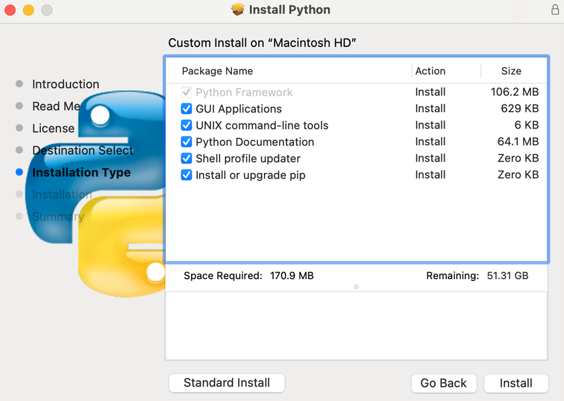
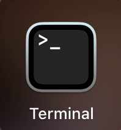

# Running the Desktop Application Tool for Mac

 Mac users can run the application tool locally from source code. Note that when you run the tool locally from source code, you must always use the command line (terminal) to open the tool. Once you have completed the steps in the 'Initial Set-Up' section, you can just follow the instruction sin the 'Run the app locally (from source code)' section below each time you want to run the tool.

***

### Instructions

#### Initial Set-Up
1. Check if you have python 3 installed.
    1. If you don't have python 3, install it. During installation, make sure you select the option to install pip at the same time. In the "Installation Type" section of the install, select the option to customize the installation and ensure that "Install or upgrade pip is checked."

    

    2. If you have python 3 installed already, check if you have pip installed; if not, install it.

2. Download DSC Desktop Application Tool zipped source code directory from [here](https://github.com/norc-heal/heal-data-pkg-tool/releases/latest/). To download:
    1. Expand "Assets" and click to download "Source code (zip)". *Note: Disregard the dsc-pkg-tool-mac.zip for now, as that is still in development.*

    

    2. The folder should automatically unzip to Downloads.

3. Open terminal.
    1. You can open terminal by searching for it within Launchpad or Finder.

    <figure markdown>
        
        <figcaption></figcaption>
    </figure>

    1. Navigate to the extracted DSC Desktop Application Tool directory.
        1.	The extracted dir name will start with ‘heal-data-pkg-tool-‘
        2.	Navigate into this directory
        3.	Within this directory, there will be many files
    2.	Make sure the following files exist in this directory
        1.	Requirements.txt
        2.	Dsc_pkg_tool.py

        !!! Warning

            **Do not move the dsc_pkg_tool.py file from its location within the 'heal-data-pkg-tool-' folder** - the executable requires the other contents contained within the folder to function.

    3. Create and activate a new python virtual environment. Make sure to name it something unique, memorable and relevant – e.g. dsc-pkg-env.

        !!! note "Virtual environments in python"
            
            To create and activate a virtual environment, follow these steps:
            
                Install virtual environment: pip3 install virtualenv
                Create virtual environment: virtualenv name-of-environment
                Activate virtual environment: source name-of-environment/bin/activate

    4. Install required packages into python virtual environment from the requirements.txt file: ‘pip install -r requirements.txt’ 

        !!! note

            You may receive an "inactive developer path" error when trying to install requirements.txt. This error can be resolved by re-installing the Command Line Tools package. Enter and run this command, and then try to install requirements.txt, again. If that still does not work, please contact us and we will help you to troubleshoot.

                xcode-select --install

#### Running the application tool locally from source code

1. Navigate to the DSC Desktop Application Tool directory (dir with requirements.txt and dsc_pkg_tool.py files)
2. Activate the python virtual environment you created during initial set-up steps above
3. Run the app from the command line: ‘python3 dsc_pkg_tool.py’
    1. If this doesn't work for you, try 'py dsc_pkg_tool.py' and 'python dsc_pkg_tool.py'
4. This should launch a multi-tab GUI (see below). 
    1. If it does this – Success! 
    2. If it does not do this – Please contact us and we will help you to troubleshoot

    