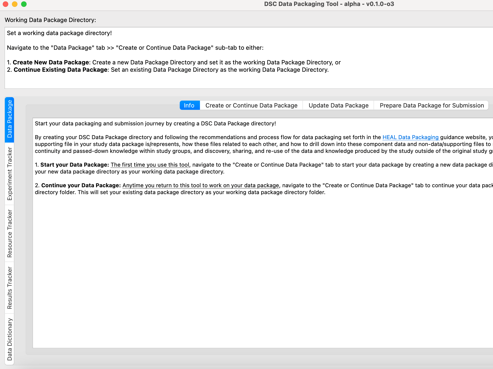

# Downloading the Desktop Application Tool for Mac

1. Navigate to the [latest release for the tool](https://github.com/norc-heal/heal-data-pkg-tool/releases/latest/){target=_blank}. 
    1. Expand "Assets" and select "dsc-pkg-tool-mac.zip" to download the tool.

    

    2. The folder should automatically unzip to Downloads.

2. Right click on the dsc-pkg-tool icon.

    

    !!! warning

        If you double click on the dsc-pkg-tool icon, you will receive a warning that the tool "cannot be opened because it is from an unidentified developer." You can bypass this error by opening via right-click.
    
3. You will receive a pop-up asking you to confirm that you want to open. Select "Open."

    <figure markdown>
        
        <figcaption></figcaption>
    </figure>

4. The tool should open:

    
