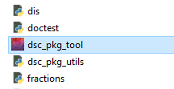

# Downloading the Desktop Application Tool for Windows

!!! Info "What to Do First"

    * **Delete previous version(s) of the tool:** If you have downloaded a previous version of the tool, delete the previous version of the tool (dsc-pkg-tool-windows\dsc_pkg_tool\ folder) prior to downloading and unzipping the current version of the tool, as having more than one version of the tool in the same file location may lead to problems with duplicate file names.
    * **DO NOT delete your dsc-pkg folder or contents:** If you have already used the tool to create/initialize your data package (i.e. created your dsc-pkg folder within your study folder), **DO NOT** delete your dsc-pkg folder or any of its contents (i.e. standard data package metadata files such as experiment, resource, and results trackers and data dictionaries)

1. Navigate to the [latest release for the tool](https://github.com/norc-heal/heal-data-pkg-tool/releases/latest/). 
2. Expand "Assets" and select "dsc-pkg-tool-windows.zip" to download the tool.
3. Unzip the files.
    * You can unzip the files to your downloads folder or to another folder that you prefer, but you must unzip the files in order to be able to run and open the tool successfully.
    
    <figure markdown>
        
        <figcaption></figcaption>
    </figure>

4. Once you have unzipped the files, open the newly created dsc-pkg-tool folder.
    * Within this folder, there will be many files and folders, but you want to locate the "dsc_pkg_tool" executable file. Double click the file to open the tool.

    <figure markdown>
        
        <figcaption></figcaption>
    </figure>

    !!! Warning

        **Do not move the dsc_pkg_tool.exe file from its location within the dsc-pkg-tool-windows\dsc_pkg_tool\ folder** - the executable requires the other contents contained within the folder to function.