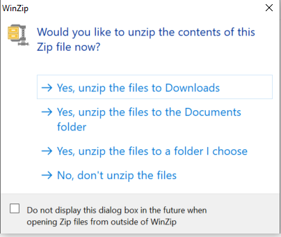

# Downloading the Desktop Application Tool for Windows

!!! Info "What to Do First"

    * **Delete previous version(s) of the tool:** If you have downloaded a previous version of the tool, delete the previous version of the tool (dsc-pkg-tool-windows folder) prior to downloading and unzipping the current version of the tool, as having more than one version of the tool in the same file location may lead to problems with duplicate file names.
    * **DO NOT delete your dsc-pkg folder or contents:** If you have already used the tool to create/initialize your data package (i.e. created your dsc-pkg folder within your study folder), **DO NOT** delete your dsc-pkg folder or any of its contents (i.e. standard data package metadata files such as experiment, resource, and results trackers and data dictionaries)

1. Navigate to the [latest release for the tool](https://github.com/norc-heal/heal-data-pkg-tool/releases/latest/). 
2. Expand "Assets" and select "dsc-pkg-tool-windows.zip" to download the tool.
3. Unzip the files.
    * You can unzip the files to your downloads folder or to another folder that you prefer.
    
    <figure markdown>
        
        <figcaption></figcaption>
    </figure>

    !!! tip

        If you did not delete your previous version of the dsc_pkg_tool before unzipping to the same folder, you can overwrite the old version of the tool with this new version by selecting "Replace the file in the destination folder" in the pop-up window.

        <figure markdown>
            {: loading=lazy width="400"} 
            <figcaption></figcaption>
        </figure>  

4. Once you have unzipped the files, the dsc_pkg_tool file will appear.

    <figure markdown>
        
        <figcaption></figcaption>
    </figure>

5. Double-click the file to open the tool.

    <figure markdown>
        
        <figcaption></figcaption>
    </figure>
