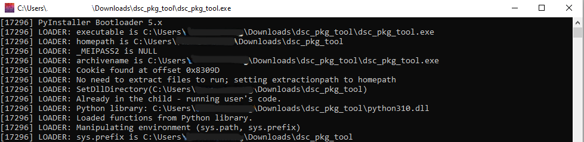
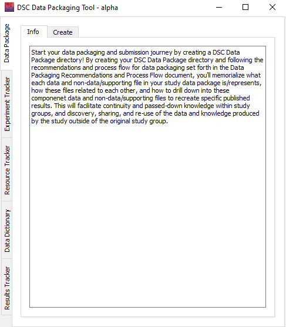
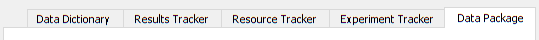
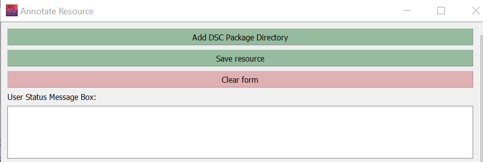

# Using the Tool

!!! note 
    When you open the tool, the window below will pop up first and start running. **Do not close it.** Once it executes, the tool will open. You will need to leave this window open when you are using the tool.

    

When the tool loads, it will look like this:
    <figure markdown>
        
        <figcaption></figcaption>
    </figure>

## Tabs

The tabs within the tool are organized sequentially to walk through the steps of data packaging: Data Package, Experiment Tracker, Resource Tracker, Data Dictionary, and Results Tracker.

Within each of these tabs, there are multiple additional tabs. Each has an "Info" tab, which provides information on what the app will create within the selected step. Depending on which domain you are viewing, the additional tabs will vary. Each individual tab will provide the necessary forms and guidance to execute the steps for that domain.

## App Messages and Guidance
### User Status Message Box

Within each tab, there is a User Status Message Box:

The User Status Message Box will print out messages when you make certain selections (e.g., select the data package directory) or save changes to files (e.g., adding a result to a results tracker). The box will provide information on the status of changes and any errors that may occur. It will also provide helpful tips on next steps. This message box is another tool meant to help you through the process, so we advise you to review the messages produced whenever you make a change.

### Guide to Text Colors

| Color   | Form Fields                         | User Status Message Box                   |
| ------- | ----------------------------------- | ----------------------------------------- |
| Blue | Required, but can be filled in  by an automatic process | Information on next steps |
| Green| Required | Successful process message |
| Black | Not required, but useful to include | Process message |
| Red | N/A | Error message |