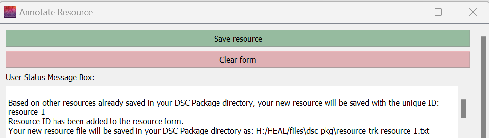

# Using the Tool

!!! note 
    When you open the tool, the window (console) below will pop up and begin running. **Do not close it.** Once it executes, the tool will open. You will need to leave this window open when you are using the tool.
    <figure markdown>
    
        <figcaption></figcaption>
    </figure>
    *Note: The screenshot above shows the Windows console. The Mac console will look slightly different.*

When the tool loads, it will look like this (Windows):
    <figure markdown>
        
        <figcaption></figcaption>
    </figure>

## Tabs

The tabs within the tool are organized sequentially to walk through the steps of data packaging: Data Package, Experiment Tracker, Resource Tracker, Results Tracker, and Data Dictionary.

Within each of these tabs, there are 2-3 sub-tabs. Each has an "Info" tab, which provides information on what the app will create within the selected step. Depending on which domain you are viewing, the additional tabs will vary. Each individual tab will provide the necessary forms and guidance to execute the steps for that domain.

## App Messages and Guidance
### Working Data Package Directory
The Working Data Package Directory will always be displayed at the top of the tool's main window. Each time you open the data packaging tool, you will first need to set your working data package directory (e.g., provide the path to your existing data package directory). This will enable the tool to interface with the data package folder during your session.

### User Status Message Box

Within each tab, there is a User Status Message Box:

The User Status Message Box will print out messages when you make certain selections or save changes to files (e.g., adding a result to a Results Tracker). The box will provide information on the status of changes and any errors that may occur. It will also provide helpful tips on next steps. This is another tool meant to help you through the process, so we advise you to review the messages and use the tips provided.

### Guide to Text Colors

| Color   | Form Fields                         | User Status Message Box                   |
| ------- | ----------------------------------- | ----------------------------------------- |
| Blue | Required, but can be filled in  by an automatic process | Information on next steps |
| Green| Required | Successful process message |
| Black | Not required, but useful to include | Process message |
| Red | N/A | Error message |