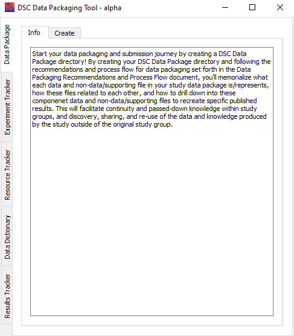

# Purpose of the HEAL Data Packaging Tool

{align=right} Compiling and accurately documenting the aspects of your study's data and supporting documents in a way that will be understandable and usable for future researchers can be a difficult task. This tool was developed to help ease the burden of understanding and effectively fulfilling HEAL data sharing requirements.

This tool provides you with easy-to-fill-out forms and added guidance that will help you to document and annotate your study's experiments, results, and resources to maximize your study's findability and replicability by future researchers.

When you fill out these forms, the tool will package up the information into different trackers, which you will then deposit into the repository you choose, along with your other data package components, as supporting documentation. The tool and the resulting trackers will provide systematic annotation of your data package, which will make your data package more understandable and usable for researchers interested in the data.

For more information on the data packaging process, such as how to prepare your data and supporting documents before starting your package and how to determine your annotation approach, refer to data packaging conceptual best practices.

