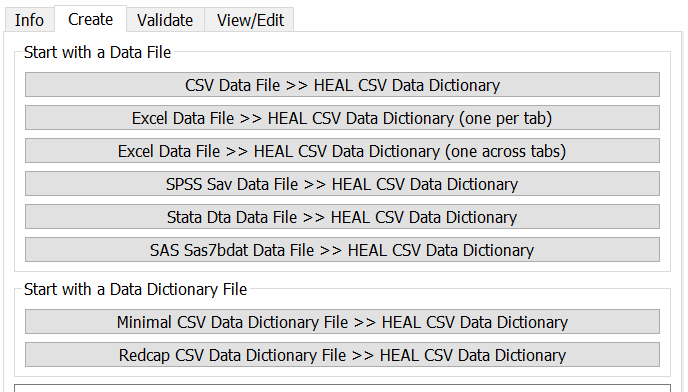

# Create a New Data Dictionary

1. When you would like to create a new data dictionary, go to the "Create" tab. You will be able to start either with a data file or a data dictionary file, if you have one.
    <figure markdown>
        
        <figcaption></figcaption>
    </figure>  

2. Select the data dictionary conversion that you would like to complete and select the corresponding file in File Explorer.

!!! note "Special considerations for certain files"

    To ensure that your files are able to be read into the tool and converted correctly, you may need to take specific steps for certain types of files.

    * [SAS files]
    * [REDCap Data Dictionaries]