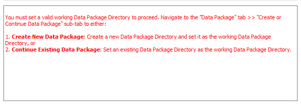
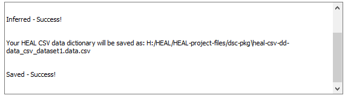
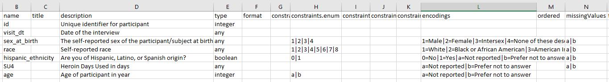
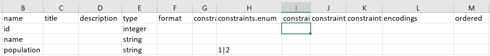
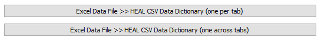

# Create a New Data Dictionary

!!! info "Reminder"

    **Your first step each time you open the tool should be to set your working data package directory.**

    * If you have not yet set your working data package directory this session, do so before attempting to create a data dictionary.
    * If you have not set your working data package directory before attempting to use the data dictionary converter, the tool will not be able to save your output data dictionary to your data package folder. You will receive the error message below.
        <figure markdown>
            
            <figcaption></figcaption>
        </figure>     

## Creating a new data dictionary
1. When you would like to create a new data dictionary, go to the "Create" tab. You will be able to start either with a data file or a data dictionary file, if you have one.
    <figure markdown>
        
        <figcaption></figcaption>
    </figure>  

    !!! warning "Special considerations for certain files"

        To ensure that your files are able to be read into the tool and converted correctly, certain file types may require some additional considerations/preparation.

        * [Multi-tab Excel files](#excel-data-file-with-multiple-tabs)
        * [SAS files](#sas-file)
        * [Minimal CSV Data Dictionaries](#minimal-csv-data-dictionary)
        * [REDCap Data Dictionaries](#redcap-data-dictionary)

2. Select the data dictionary conversion that you would like to complete and select the corresponding file in File Explorer.

3. If the conversion is successful, then the User Status Message Box will print a successful message:
    <figure markdown>
        
        <figcaption></figcaption>
    </figure>  

4. Some input file types contain more metadata than others, so depending on the input file, you may need to take additional steps to ensure you have a valid HEAL-compliant data dictionary.

## Ensuring that you have a valid HEAL data dictionary

Once you have output your data dictionary, you may have to take additional steps, depending on your original input file type, to ensure that your data dictionary is "valid." A valid HEAL-compliant data dictionary will contain at least a name and description for each variable.

**If you started with an input file that was rich in metadata, this metadata will be extracted by the tool.** You can expect that the data dictionary output by the tool will be fairly complete and likely will be valid. Metadata-rich files include SPSS and Stata files, and SAS files (if a sas7bcat file is included).

Similarly, if you input a REDCap CSV data dictionary, your output HEAL CSV data dictionary should be fairly complete and valid.

*Example of the data dictionary output based on a metadata-rich file:*
    <figure markdown>
    
    <figcaption></figcaption>
</figure>

**If you started with a CSV or Excel file, however, the output data dictionary will be a "minimal data dictionary."** Unlike metadata-rich files (SPSS, Stata, SAS), which contain information about variable names, labels, and encodings within the file, CSV and Excel files do not contain this metadata. Therefore, the output data dictionary will contain the variable names and types, but not descriptions. The tool will also attempt to infer whether variables are categorical, and if so, what those categories are. However, if there are categories not included in the data, those will not be able to be inferred and included.

*Example of the data dictionary output based on a CSV or Excel file:*
    <figure markdown>
    
    <figcaption></figcaption>
</figure>

**If you start with a non-metatadata-rich file, you will need to edit your data dictionary after it has been output.** For the data dictionary to be considered valid, each variable must have a name and description. You may also want to add in additional constraints that the tool did not infer such as variable encodings.

For more information on the additional columns within the HEAL-compliant data dictionary output by the tool as well as guidance on which fields may be most useful to prioritize filling out, refer to the [Data Dictionary metadata schema](../schemas/md_data_dict.md){target=_blank}.

## Special considerations for specific file types

Certain data files and data dictionaries may require additional steps and preparation. See below for information on these specific circumstances for certain data files.

* [Excel Data File with multiple tabs](#excel-data-file-with-multiple-tabs)
* [SAS File](#sas-file)
* [Minimal CSV Data Dictionary](#minimal-csv-data-dictionary)
* [REDCap Data Dictionary](#redcap-data-dictionary)

### Excel Data File with multiple tabs

In order for the tool to successfully produce a data dictionary from an Excel file with multiple tabs, each tab within that Excel must first be a **clean dataset** that follows a standard tabular format: the top row should list all variables across the columns and the columns should contain the data.

Once you have a clean dataset in each tab, there are two options for output for Excel data files with multiple tabs.
        <figure markdown>
    
    <figcaption></figcaption>
</figure>  

1. **Excel Data File >> HEAL CSV Data Dictionary (one per tab)**
    1. This will take a multi-tab Excel file and output one data dictionary for each tab in the Excel. The naming convention of the file will be 'heal-csv-dd-filename-tabname.'
    2. Each data dictionary will include a row for every variable within that specific tab.

2. **Excel Data File >> HEAL CSV Data Dictionary (one across tabs)**
    1. This will take a multi-tab Excel file and output a single data dictionary with structure 'heal-csv-dd-filename.'
    2. This single data dictionary will include a row for every variable across all tabs.
    3. If you use this method, it is important that you ensure that variable names across sheets are consistent.
        1. This works particularly well if your data is structured such that the same variables are used across sheets.
        1. However, if you are using the same variable name in multiple different sheets, but it does not have the same meaning in each sheet, you should either vary the name of variables across sheets or you should use the one per tab option.

### SAS File

For tabular files saved in SAS (sas7bdat), you will want to have an accompanying catalog file (sas7bcat). Although the sas7bdat contains variable metadata information (variable names and variable labels/descriptions), the sas7bcat contains information about the formats and encoding of the variables, which are important for producing a complete data dictionary.

#### Creating a sas7bdat and sas7bcat file

{{ external_markdown('https://raw.githubusercontent.com/HEAL/healdata-utils/main/docs/vlmd/extract/sas.md', '## Creating a `sas7bdat` and a `sas7bcat` file') }}

#### Running through the tool

After creating the necessary sas7bdat and sas7bcat files, you are ready to convert to a HEAL-compliant data dictionary using the data packaging tool. 

**Before you begin, ensure that your sas7bdat and sas7bcat files are saved in the same folder.** The tool will only ask you to select your sas7bdat file. If the sas7bcat file is located in the same directory, the tool will automatically detect it, as well. If not detected, the tool will run without the sas7bcat catalog file and the encodings (i.e., value labels) will not be extracted from the catalog file and will not appear in your data dictionary. The output will be a minimal HEAL-compliant data dictionary.

### Minimal CSV Data Dictionary

If you have already created a data dictionary in CSV format, you can also use that to generate a HEAL-compliant data dictionary. 

**The only requirements for a "minimal CSV data dictionary" to be ingested by the tool and converted into a HEAL-compliant data dictionary are two columns: name and description.** With these two columns included, the data dictionary output will be a valid data dictionary (although it will be a fairly minimal data dictionary).

However, this does not mean that you must only include these two columns. You may already have additional columns in your existing data dictionary, or you may want to add columns beyond name and description to better describe your dataset. For information on which additional columns it may be most helpful to include within your minimal data dictionary, and how to create, label, and format them to be successfully ingested and output by the data dictionary converter tool, refer to the [HEAL Data Dictionary metadata schema](../schemas/md_data_dict.md){target=_blank}.

### REDCap Data Dictionary

If you collected data in a [REDCap](https://www.project-redcap.org){target=_blank} data management system, HEAL-compliant data dictionaries can be generated directly from an exported REDCap data dictionary.

The REDCap data dictionary export serves the purpose of providing variable-level metadata in a standardized, tabular format and is generally easy to export.

#### Export your REDCap data dictionary

{{ external_markdown('https://raw.githubusercontent.com/HEAL/healdata-utils/main/docs/vlmd/extract/redcapcsv.md', '## Export your Redcap data dictionary') }}

