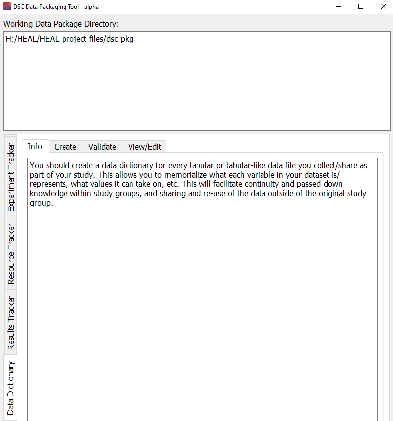

---
hide:
  - toc
full-width: true
---

# About the Data Dictionary Tab

{: loading=lazy width="550" align=right }This tab creates HEAL-compliant data dictionaries, which provide metadata, including variable labels and values, for tabular or tabular-like data files in your data package. You should create a data dictionary for ***each*** tabular or tabular-like data file you collect/share as part of your study.

The HEAL data dictionary converter can take data files and data dictionary files as inputs. Data files accepted include CSV files, Excel files with multiple tabs, SPSS .sav files, Stata .dta files, SAS .sas7bdat files. Data dictionary files accepted include REDCap CSV data dictionary files and minimal CSV data dictionary files.

Before attempting to convert your tabular data file into a HEAL-compliant data dictionary, you may have to complete a few specific steps based on the file type (e.g., for REDCap data dictionaries, you must download from REDCap in the correct format). In order to ensure your input file is in the correct format, review the instructions [here](create.md).

 
!!! tip "Tips and Best Practices for Data Dictionaries"

    1. We recommend that you save all of your HEAL-compliant data dictionaries in the same folder. The tool will automatically do this for you. Any data dictionary you create with the tool will be output into your dsc-pkg folder.
    2. You should apply a consistent naming convention to your data dictionaries. The tool will do this for you. Any data dictionary you create will be output with the same file name with "heal-csv-dd" appended at the beginning.