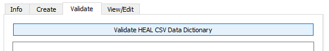
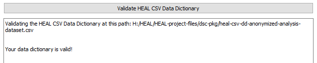
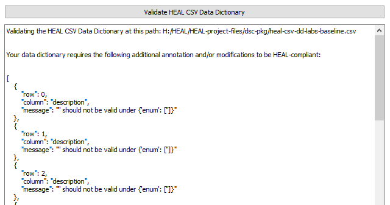

# Validate a Data Dictionary

You can use the Data Dictionary Validation tool to confirm that your data dictionary is HEAL-compliant. You may want to do this if you have made edits to a data dictionary that was produced by the tool or if you have another data dictionary that you believe could be considered HEAL-compliant.

Before using the validation feature, you may want to review your data dictionary to confirm that you think it is likely HEAL-compliant. Please refer to the [Data Dictionary schema](../schemas/md_data_dict.md){target=_blank} for information on what makes a data dictionary HEAL compliant.

1. Select Validate HEAL CSV Data Dictionary.
    <figure markdown>
        
        <figcaption></figcaption>
    </figure>

2. Navigate to and select the data dictionary you would like to validate.
3. The User Status Message Box will print out a message with some information about the validation attempt.
    1. If the data dictionary is HEAL-compliant, the user status message box will print out a confirmation message.

        <figure markdown>
            
            <figcaption></figcaption>
        </figure>

    2. If the data dictionary is *not* HEAL compliant, the user status message box will print out information about what part of the validation failed.
        1. For more information about what needs to be changed/added to make your data dictionary HEAL-compliant, refer to the [Data Dictionary schema](../schemas/md_data_dict.md).
        2. In the below example, the data dictionary is missing descriptions for the variables. Description is a required field, so the validation fails.

        <figure markdown>
            
            <figcaption></figcaption>
        </figure>

4. Once you have a validated, HEAL-compliant data dictionary, this step is complete. 
    1. If you make any edits to the data dictionary after validating, you should run the validation again to confirm that it is still compliant.