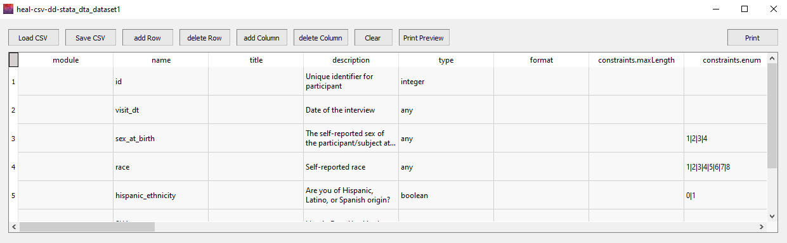

---
hide:
  - toc
full-width: true
---

# Viewing or Editing a Data Dictionary

If you would like to view or edit any of your existing HEAL-compliant Data Dictionaries, you can use the "View/Edit" feature. This feature may be especially useful if you have input a non-metadata-rich file type into the data dictionary tool (e.g., CSV, Excel) and would like to manually add some additional information to the output data dictionary beyond name and description, such as encodings, constraints, and formats.

This tool is meant to allow you to more easily edit your data dictionary. However, you can also make edits directly in the CSV within Excel or another spreadsheet program. If you do make edits directly within the CSV, be sure to re-save it as a CSV each time you make edits.

---

1. Navigate to "View/Edit" on the Data Dictionary tab. Select "View/Edit CSV."

    <figure markdown>
        
        <figcaption></figcaption>
    </figure>

2. The window below will pop up. Select "Load CSV."
    1. Navigate to your working data package directory (you will not automatically be taken to your working data package directory) and select the HEAL-compliant data dictionary you would like to view or edit.
    2. Your data dictionary will populate in the window. You will be able to make edits here.

        <figure markdown>
            
            <figcaption></figcaption>
        </figure>

    3. When you have finished making edits, be sure to select "Save CSV" before closing the window.