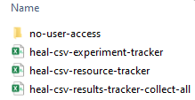

# Creating a Data Package Directory

1. Click on the "Data Package" tab. 
2. Within the "Create" tab, select "Create New Data Package."

    <figure markdown>
        
        <figcaption></figcaption>
    </figure>

3. Select the location where you want to save the Data Package directory in the File Explorer pop up window.
4. Once you select a location, the folder "dsc-pkg" will appear within that folder. The tool will also display the new folder location in the user status message box and set the dsc-pkg folder you have just created as your working data package directory for the current session:

    <figure markdown>
        
        <figcaption></figcaption>
    </figure>

5. Your new dsc-pkg directory will contain an empty Experiment Tracker and Resource Tracker. The following steps will guide you through how to use the tool to fill out the Experiment Tracker, Resource Tracker, and Results Tracker (the last of which will be created as you move through the process of entering results information).

    <figure markdown>
        
        <figcaption></figcaption>
    </figure>
