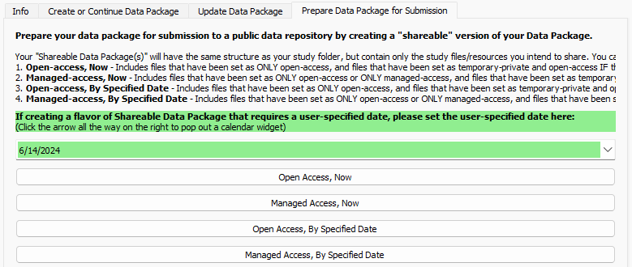
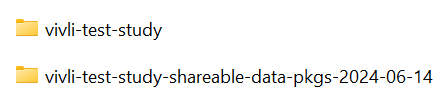

---
hide:
  - toc
full-width: true
---

# Prepare Your Data Package for Submission

Once you have finished preparing your data package locally, you can use this tab to prepare your data package for submission to a repository. The "flavor(s)" of shareable data package that you produce for submission to a repository will depend on how and when you want to share your data. For guidance on how to determine what flavor(s) of shareable data package, refer to the [Data Packaging Guidance Documentation](https://norc-heal.github.io/heal-data-pkg-guide/submit/){target="_blank"} on preparing your data package for submission.

1. First, select the flavor of data package that you want to prepare:  
    1. Open-access now
    2. Managed-access now
    3. Open-access by specified date
    4. Managed-access by specified date

    <figure markdown>
        
        <figcaption></figcaption>
    </figure>

    1. The date entered into the green box will set the date at which your shareable data package can be accessed by other researchers at your selected repository. This will automatically be set to today's date.

        <figure markdown>
            
            <figcaption></figcaption>
        </figure>

        1. For data packages that only contain study files/resources that can be shared right now, you do not need to make any changes to this field.
        2. For open-access by specified date and managed-access by specified date shareable data packages, which contain study files/resources that will be shared with embargo restrictions applied, you will need to enter the date when you would like your shareable data package to become available (i.e., the date that the embargo will be lifted).
        
        <figure markdown>
            
            <figcaption></figcaption>
        </figure>

2. After you select the flavor of shareable data package you would like to create, the User Status Message Box will print out a message confirming the shareable data package has been created, as well as its location.
    1. In the example below, an open-access by specified date shareable data package was created with a specified date of 01/01/2025.
    2. The User Status Message Box will also print out some reminders about how and when you should submit your newly created shareable data package to your chosen repository tailored to the flavor of shareable data package you have created.

        <figure markdown>
            
            <figcaption></figcaption>
        </figure>

3. Next, you should review your newly created shareable data package to confirm that all files you intend to share are included (and any files you do not intend to share are not included).
    1. Navigate to the directory in which your original study folder is located. You will see a new folder has been created. The name of this folder will be your study folder name with "-shareable-data-pkgs-yyyy-mm-dd" appended. In the below example, the folder title became "vivli-test-study-shareable-datapkgs-2024-06-12." The date on this folder will be today's date.

        <figure markdown>
            
            <figcaption></figcaption>
        </figure>

    2. Open this folder; it will contain any shareable data packages you have created. Once you have opened the folder, confirm that it contains:
        1. Each type (i.e., "flavor") of shareable data package you have created on today's date (with the dates appropriately specified, as necessary)
        2. A HEAL CSV Resource Tracker - This will be your overview Resource Tracker, which designates which files are shared in which shareable data package.
        3. A README file

        <figure markdown>
            
            <figcaption></figcaption>
        </figure>

    3. Open the heal-csv-resource-tracker in this folder and review the first column(s), which should denote which files are shared in each shareable data package within this folder.
        1. In the example below, Columns A-D represent each individual flavor of shareable data package created on this date. If you only created one type of shareable data package today, there will only be one such column in this tracker. 
        2. As a reminder, each row corresponds to a resource. If the resource is shared in the shareable data package denoted in the column, the value of that row will be 1. If the resource is not shared in the shareable data package denoted in the column, the value of that row will be 0.

        <figure markdown>
            
            <figcaption></figcaption>
        </figure>

        !!! note

            **A resource can be found in more than one "flavor" of shareable data package.**

            * An open-access-by-date shareable data package should also contain all resources that would be included in an open-access-now shareable data package; it should not include any managed access files.
            * A managed-access-by-date shareable data package should also contain all resources that would be included in an open-access-now, open-access-by-date, and managed-access-now shareable data package.

    4. We encourage you to review each of the shareable data packages before sharing them publicly to ensure that each contains only the resources which you intend to share. Open one of your shareable data packages.
        1. The folder structure within your shareable data package should mirror that of your study folder/local data package. Some folders may be empty; this will occur if you did not share any resources from those folders in this flavor of shareable data package.

        <figure markdown>
            
            <figcaption></figcaption>
        </figure>

        2. With the dsc-pkg folder, you will find the following files:

            * An Experiment Tracker
            * A Resource Tracker
            * Results Tracker(s), if applicable
            * Data Dictionary(ies), if applicable
            * A shareable-pkg-creation-metadata file
        
        1. The Resource Tracker will consist of a list of all resources. Column A will be named 'shared,' and will denote whether each resource is shared in this shareable data package.
        2. The shareable-pkg-creation-metadata file consists of metadata including the date the data package was created, the "flavor" of data package, and access date (either the present day in the case of open/managed-access-now data packages, or a date in the future). The example below shows the content of this file for a managed-access-by-date shareable data package, with an access date of 1/1/2025.

            <figure markdown>
                
                <figcaption></figcaption>
            </figure>

4. Once you have reviewed and confirmed your shareable data package only contains resources intended for sharing under the designated conditions, your shareable data package is ready for submission to a repository.
    1. Before you submit, zip up your shareable data package folder. This step will ease submission, as it creates a single compressed zip file for upload.
    2. When you are ready to upload your shareable data package to your chosen repository, you should include:
        1. Your zipped up shareable data package folder
        2. Two files from the "your-study-shareable-data-pkgs-yyyy-mm-dd" folder:
            1. Overview Resource Tracker (heal-csv-resource-tracker in this folder)
            2. README file