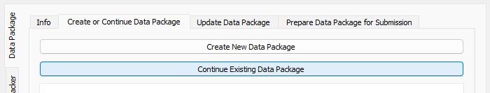
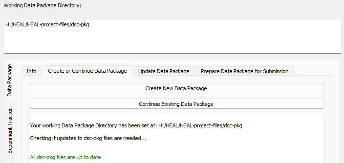

# Setting Your Working Data Package Directory

Although you will only need to create your data package once, you will need to set your data package working directory each time you open the tool. This will allow the tool to interface with your data packaging folder and its contents. To set your working data package directory:

1. Navigate to the "Create or Continue Data Package" and select "Continue Existing Data Package."

    <figure markdown>
        
        <figcaption></figcaption>
    </figure>

2. Navigate to the data packaging directory on which you would like to work and select the folder.
3. Once you select the directory, the tool will review the files within your dsc-pkg folder and confirm that they are up to date with the most recent version of the tool.
    1. ***If your dsc-pkg folder is up to date with the most recent version of the tool:***
        1. The User Status Message Box will print out a result that your working data package directly has been set. It will also print a confirmation that the dsc-pkg files are up to date. 
        2. The file path to your working data package directory will also appear in the box at the top of the tool. This path will remain at the top of the tool throughout your session.

        <figure markdown>
            
            <figcaption></figcaption>
        </figure>
    
    2. ***If your dsc-pkg folder is not up to date with the most recent version of the tool:***
        1. The User Status Message Box will print out a warning that some files in your data package directory are not up to date. 
        2. You will need to update the dsc-pkg directory using the [Audit and Update] feature.

        <figure markdown>
            
            <figcaption></figcaption>
        </figure>