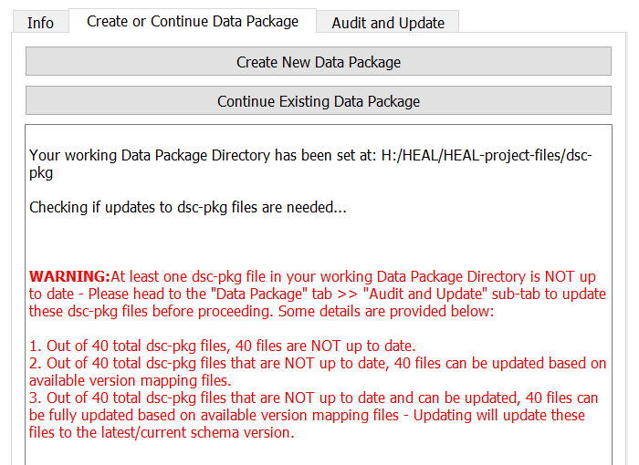
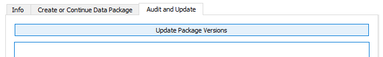
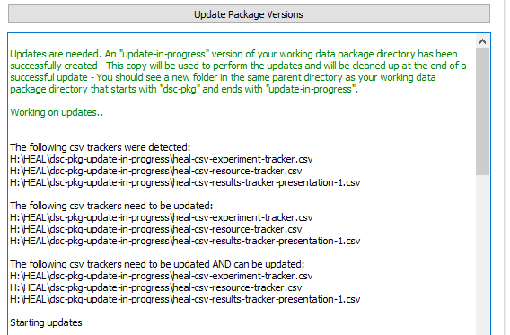
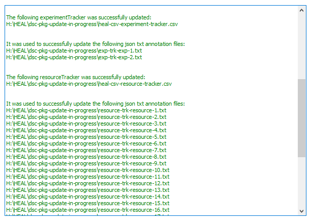
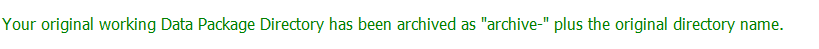

# Auditing and Updating A Data Package Directory

1. If you try to "Continue an Existing Data Package" and the files within your data package are not up to date with the current version of the tool, you will receive a warning message to update your files before proceeding.

    <figure markdown>
        
        <figcaption></figcaption>
    </figure>

2. To update your data package, navigate to "Audit and Update" tab and select "Update Package Versions."

    <figure markdown>
        
        <figcaption></figcaption>
    </figure>

    1. Depending on the size of the data package you are updating, this may take a few minutes.
    2. First, the tool will audit the current files within your data package and determine which need to be updated.

    <figure markdown>
        
        <figcaption></figcaption>
    </figure>

    3. Next, the tool will update the necessary files and print out confirmation of the update in the user status message box, as well as information on any files that were unable to be updated.

    <figure markdown>
        
        <figcaption></figcaption>
    </figure>

3. After updating your data package, your newly updated data package will have the same name as your original data package. The original version of the data package directory will be saved with an archive label. The user status message box will print a confirmation of this.
    <figure markdown>
        
        <figcaption></figcaption>
    </figure>