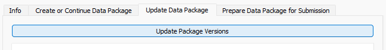
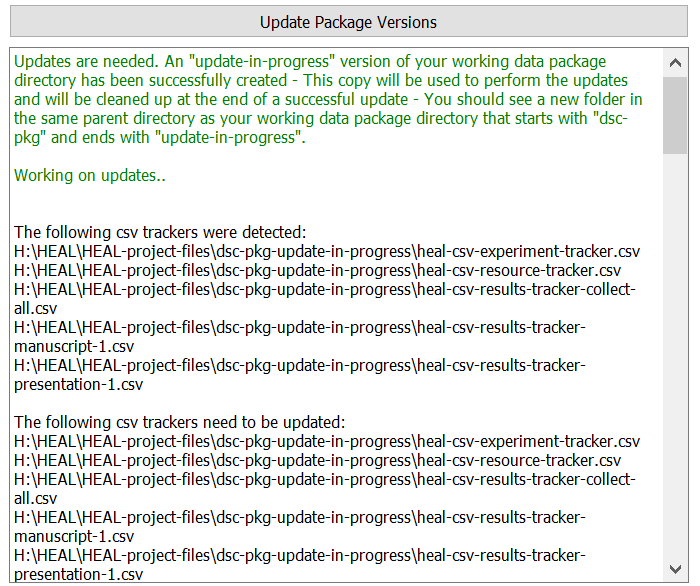
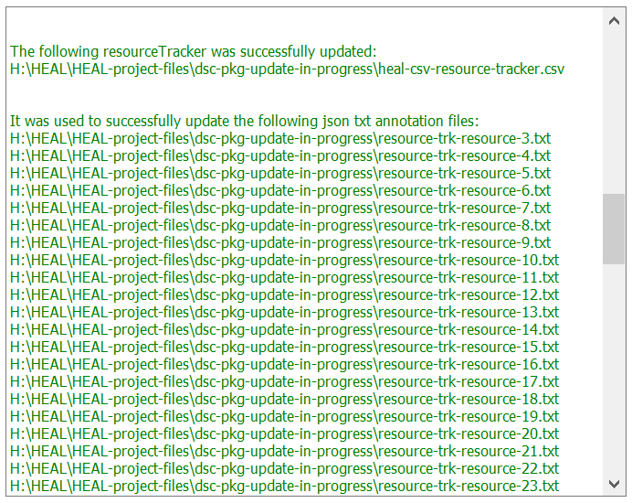

# Auditing and Updating A Data Package Directory

1. If you try to "Continue an Existing Data Package" and the files within your data package are not up to date with the current version of the tool, you will receive a warning message to update your files before proceeding.

    <figure markdown>
        
        <figcaption></figcaption>
    </figure>

2. To update your data package, navigate to "Audit and Update" tab and select "Update Package Versions."

    <figure markdown>
        
        <figcaption></figcaption>
    </figure>

    1. Depending on the size of the data package you are updating, this may take a few minutes.
    2. First, the tool will audit the current files within your data package and determine which need to be updated.

    <figure markdown>
        
        <figcaption></figcaption>
    </figure>

    3. Next, the tool will update the necessary files and print out confirmation of the update in the user status message box.

    <figure markdown>
        
        <figcaption></figcaption>
    </figure>

3. Your newly updated data package will be called "dsc-pkg-update-in-progress."
4. After updating your data package, you will need to re-set your working data package directory as the newly updated data package.
    1. Return to the "Create or Continue Data Package" tab and select "Continue Existing Data Package."

    <figure markdown>
        
        <figcaption></figcaption>
    </figure>

    2. Navigate to the folder that holds your original dsc-pkg, and select the "dsc-pkg-update-in-progress" folder.

    <figure markdown>
        
        <figcaption></figcaption>
    </figure>

    3. The tool will check this folder to confirm all files are updated and print a confirmation message in the user status message box.

    <figure markdown>
        
        <figcaption></figcaption>
    </figure>