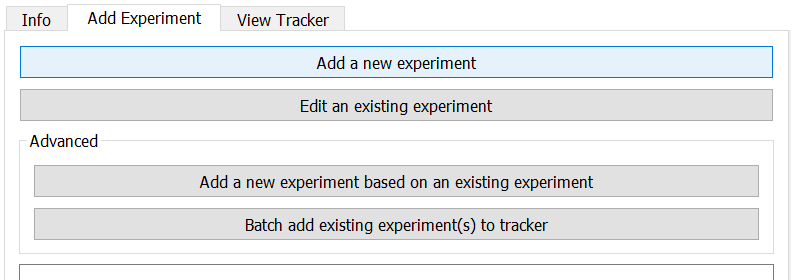
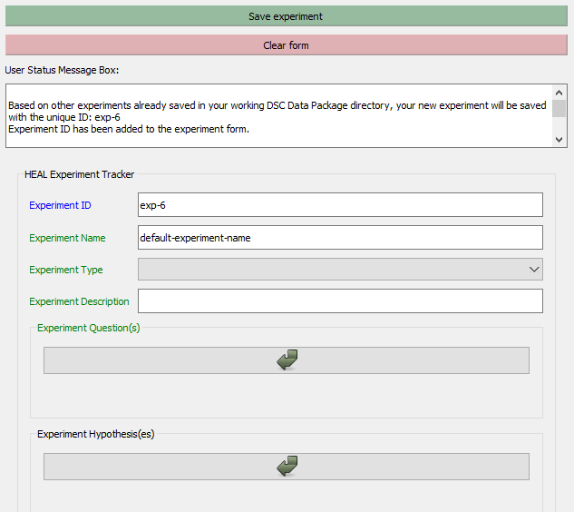
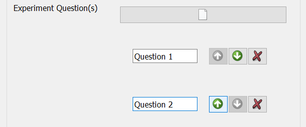
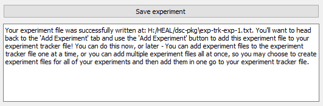

# Adding a New Experiment

### Getting Started Annotating

1. Navigate to the "Add Experiment" tab and select "Annotate a new experiment".

    <figure markdown>
        
        <figcaption></figcaption>
    </figure>

2. The experiment ID will generate automatically and sequentially.

    <figure markdown>
        
        <figcaption></figcaption>
    </figure>

### Filling Out the Form

!!! Tip
    For additional information about each form field, please refer to the [Experiment Tracker schema](../schemas/md_experiment_tracker.md).

3. You can add multiple experimental questions and hypotheses for the same experiment.
    * To add an experiment question/hypothesis, click on the paper icon. 
    * To add another, click on the paper icon again.

    When you have multiple questions/hypotheses entered, you can also change the order using the highlighted arrows. You can also use the 'X' to remove questions/hypotheses entered.

    <figure markdown>
        
        <figcaption></figcaption>
    </figure>

### Saving Your Experiment

4. Once you have finished entering the experiment information, select "Save experiment." 
    1. Navigate to your dsc-pkg folder, and save this file in the main folder. 

        If the experiment is saved successfully, this message will appear in the User Status Message Box:

        <figure markdown>
            
            <figcaption></figcaption>
        </figure>

    2. Your result tracker annotation will be saved as a .txt file within the dsc-pkg folder.
    <figure markdown>
        
        <figcaption></figcaption>
    </figure>

5. After you have added a new experiment, you will need to add it to the Experiment Tracker. Click here for guidance on [how to add an experiment to the experiment tracker](exptotrack.md).