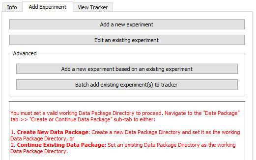
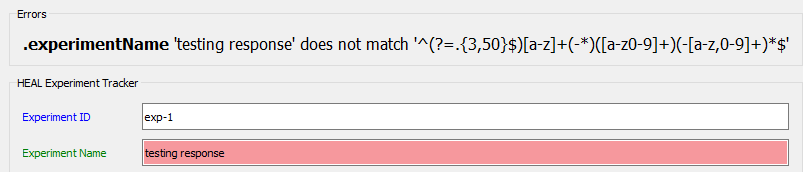
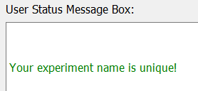
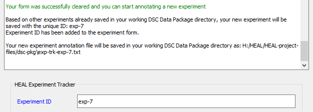

# Adding a New Experiment

### Getting Started

!!! info "Reminder"
    **Your first step each time you open the tool should be to set your working data package directory.** 
    
    * If you have not yet set your working data package directory this session, do so before attempting to annotate.
    * If you have not set your working package directory before attempting to annotate an experiment, the tool cannot automatically generate your experiment-ID or connect your experiment to your data package folder. You will receive the error message below.

        

1. Navigate to the "Add Experiment" tab and select "Add a new experiment".

    <figure markdown>
        
        <figcaption></figcaption>
    </figure>

2. The tool will generate your experiment ID automatically and sequentially, based on what is already in your working data package directory.

    <figure markdown>
        
        <figcaption></figcaption>
    </figure>

### Filling Out the Form

!!! Tip
    For additional information about each form field, please refer to the [Experiment Tracker schema](../schemas/md_experiment_tracker.md).

1. In addition to the experiment ID, you can provide an experiment name.
    1. The experiment name should be a shorthand name for the experiment in the format provided above, with words separated by a "-". 
        1. Although not required, filling in the experiment name may help your internal team, as well as external investigators, to quickly understand the purpose and content of the experiment without having to read through the description, questions, and hypotheses.
    2. If you do not follow the required format, you will receive an error:

        <figure markdown>
            
            <figcaption></figcaption>
        </figure>
    
    3. Your experiment name must also be unique. 
        1. When you enter an experiment name, the tool will review your other annotated experiments to confirm that the experiment name you have assigned is unique. 
        2. If your experiment name is unique, the User Status Message Box will print a confirmation:

        <figure markdown>
            
            <figcaption></figcaption>
        </figure>

3. You can add multiple experimental questions and hypotheses for the same experiment.
    * To add an experiment question/hypothesis, click on the paper icon. 
    * To add another, click on the paper icon again.

    When you have multiple questions/hypotheses entered, you can also change the order using the highlighted arrows. You can also use the 'X' to remove questions/hypotheses entered.

    <figure markdown>
        
        <figcaption></figcaption>
    </figure>

### Saving Your Experiment

4. Once you have finished entering the experiment information, select "Save experiment." 
    1. Navigate to your dsc-pkg folder, and save this file in the main folder. 

        If the experiment is saved successfully, this message will appear in the User Status Message Box:

        <figure markdown>
            
            <figcaption></figcaption>
        </figure>

    2. Your experiment annotation will be saved as a .txt file within the dsc-pkg folder.
    <figure markdown>
        
        <figcaption></figcaption>
    </figure>

5. After you have added a new experiment, you can annotate a new experiment or add annotated experiment(s) to the Experiment Tracker. Click here for guidance on [how to add an experiment to the Experiment Tracker](exptotrack.md).

    1. If you would like to annotate a new experiment, you can select "Clear form" at the top of the Annotate Experiment window. This will reset your form and generate the next sequential experiment ID, so you can start annotating.
        2. The User Status Message Box will print a message confirming your form was successfully cleared and that the new sequential ID has been generated.

        <figure markdown>
            
            <figcaption></figcaption>
        </figure>