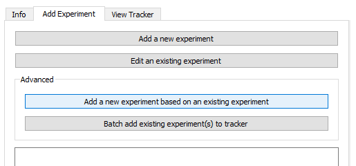
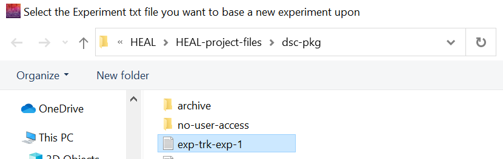
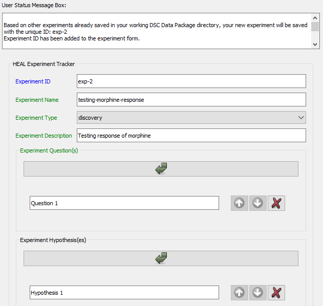
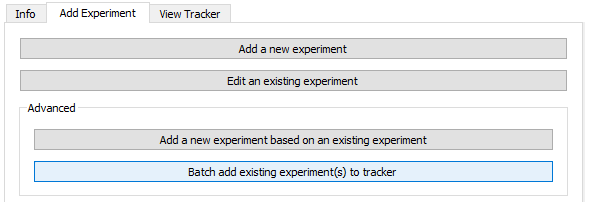
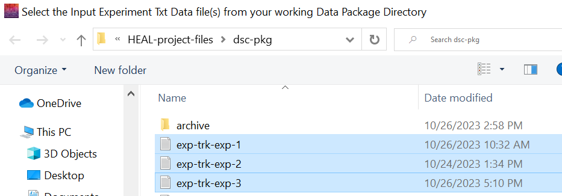
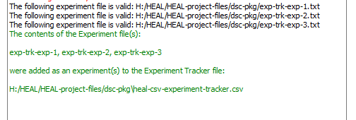

# Advanced

## Add a New Experiment Based on Existing Experiment

If you need to annotate an experiment that is very similar to a previously annotated experiment, with only slight changes, you may want to use the "Add a new experiment based on existing experiment" option. 

With this feature, you will select a previously annotated experiment, and tool will copy the information from the chosen experiment into a new experiment form with a unique experiment-ID. You will then only need to edit the information rather than reproduce it.

1. Select "Add a new experiment based on an existing experiment."

    <figure markdown>
        
        <figcaption></figcaption>
    </figure>

2. Your working data package folder will open automatically. Select the experiment on which you want to base your new experiment annotation. 

    <figure markdown>
        
        <figcaption></figcaption>
    </figure>

3. The annotate experiment form will open and populate with the selected experiment information with a unique ID.

    <figure markdown>
        
        <figcaption></figcaption>
    </figure>

4. Edit the form to reflect the differences in this new experiment. Save the form.

## Batch Add Experiment(s) to Tracker

If you try to save an experiment while you have the Experiment Tracker open, you will receive an error. The annotated experiment file will save as a .txt file within the dsc-pkg folder, but it will not be added to the Experiment Tracker. You will need to do this manually using the "Batch add existing experiment(s) to tracker" option.

1. Ensure that your Experiment Tracker is closed before attempting to batch add experiments.
1. Navigate to the "Add Experiment" tab and select "Batch add existing experiment(s) to tracker" under "Advanced."

    <figure markdown>
        
        <figcaption></figcaption>
    </figure>

3. Select the experiments that you want to add.
    1. It may be easiest to select all existing annotated experiment files when using this feature. The tool will scan the experiment files you select and only add those that are not already included in the Experiment Tracker.
    2. Note: These files follow the naming convention "exp-trk-exp-"

    <figure markdown>
        
        <figcaption></figcaption>
    </figure>

4. If your files are successfully added to the Experiment Tracker, the User Status Message Box will provide a confirmation message:

    <figure markdown>
        
        <figcaption></figcaption>
    </figure>