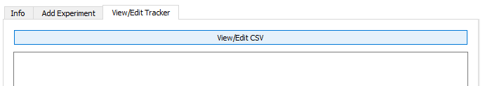
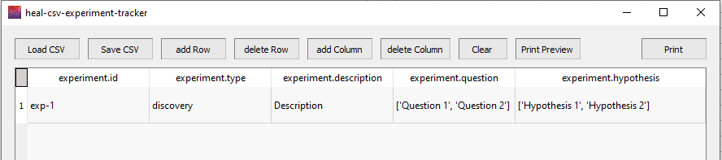

# Editing the Experiment Tracker

If you need to edit anything that you have already input into the Experiment Tracker, you can use the Edit Tracker feature.

!!! warning

    When you find an error within the Experiment Tracker that you want to fix, **we encourage you to go back and re-add the corresponding experiment and re-add to the tracker rather than entering/editing the information manually**. 
    
    The "Annotate a new experiment" form automatically puts the information you enter into the correct formatting and structure for the tracker. **Manual edits will not necessarily be in the correct format.**

1. Navigate to "View/Edit Tracker" on the Experiment Tracker tab. Select "View/Edit CSV".

    

2. The window below will pop up. Select "Load CSV"

    * Find and select the experiment tracker.
    * Your experiment tracker will populate in the window.

    

3. Using this window, you can add blank rows or columns, delete rows or columns, and print/print preview the worksheet. You can also directly enter information in this window by selecting a cell.

    * After you make any changes, you will need to "Save CSV" before closing this window for those changes to take effect.