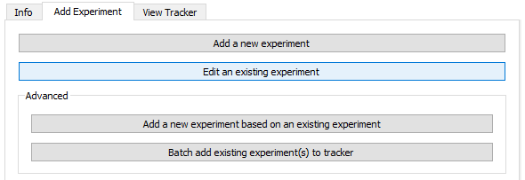
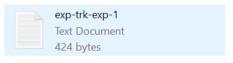
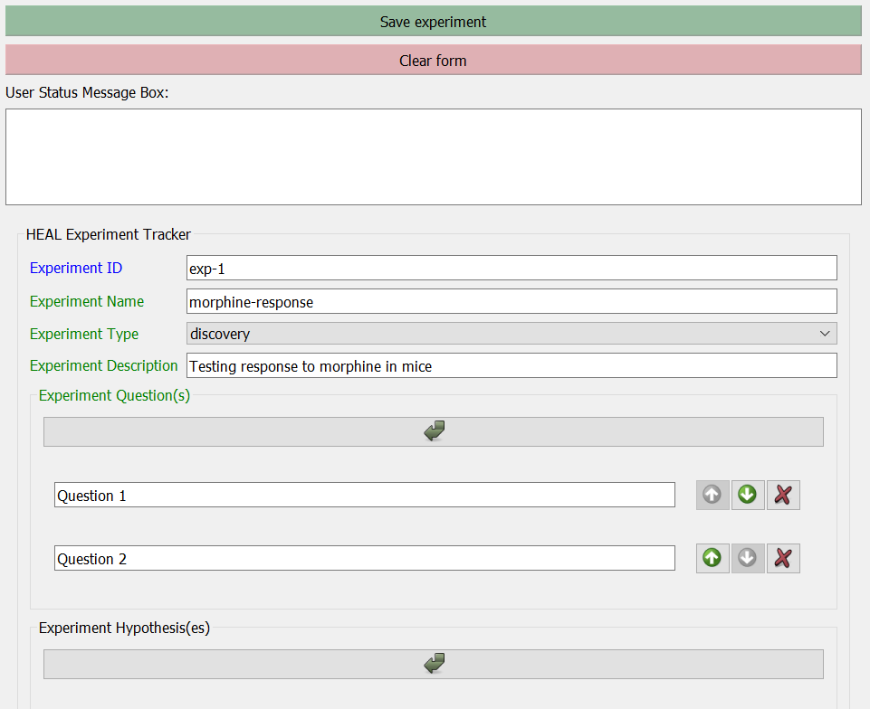
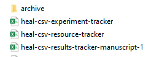

---
hide:
  - toc
full-width: true
---

# Editing an Experiment

If you want to edit an experiment annotation after you have created it, you can do so in the tool using the "Edit an existing experiment" feature. 

!!! Info
    We encourage you to use the form to edit your experiments rather than entering/editing information manually into the Experiment Tracker CSV, as the tool will automatically put your information into the correct formatting and structure. Manual edits will not necessarily be in the correct format.

1. Select "Edit an existing experiment" in the "Add Experiment" tab.

    <figure markdown>
        
        <figcaption></figcaption>
    </figure>

2. Navigate to your dsc-pkg folder and select the annotated experiment .txt file that you want to edit.

    *For example:*

    <figure markdown>
        
        <figcaption></figcaption>
    </figure>

3. The information on your annotated experiment will populate in the "Annotate Experiment" window.

    <figure markdown>
        
        <figcaption></figcaption>
    </figure>
        

4. Make any necessary edits to your experiment file, and then select "Save experiment."

    1. When you save your edited experiment, the tool will archive the original version of your experiment annotation (.txt) file in an "archive" folder, so there are no issues with duplicate file naming.

        <figure markdown>
            
            <figcaption></figcaption>
        </figure>