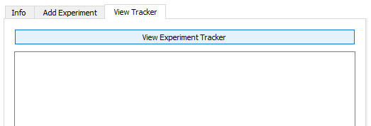
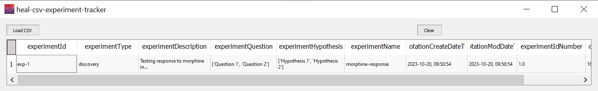

---
hide:
  - toc
full-width: true
---

# Viewing the Experiment Tracker

If you need to view anything that you have already input into the Experiment Tracker, you can use the View Tracker feature. It may be useful to view your Experiment Tracker within the application to:

* Reviewing which experiments you have already annotated and determining which you still need to annotate.
* Finding/confirming the experiment ID for a particular experiment to include in resource annotation or to determine edits that need to be made when there has been a change.

***

1. Navigate to "View Tracker" on the Experiment Tracker tab. Select "View CSV".

    <figure markdown>
      
      <figcaption></figcaption>
    </figure>

2. The window below will pop up. Select "Load CSV"

    1. Find and select the experiment tracker.
    2. Your experiment tracker will populate in the window.

    <figure markdown>
      
      <figcaption></figcaption>
    </figure>
