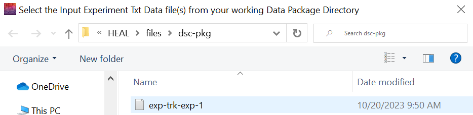

---
hide:
  - toc
full-width: true
---

# Adding an Experiment to the Experiment Tracker

1. After adding a new experiment, you will need to add it to your study's Experiment Tracker. Close the "Annotate a new experiment" window and select "Add experiment to tracker" in the "Add Experiment" tab.

    

2. When the File Explorer window pops up, navigate to the dsc-pkg folder and select the text file you want to add to the tracker. 

    * For the first experiment added, the file name will be "exp-trk-exp-1".

    

3. A second File Explorer window will pop up prompting you to select the data package directory where the experiment tracker is saved. 

    * This will be your dsc-pkg folder, which is the same location where your experiment text file was saved. 
    * Select the dsc-pkg folder.
    * Once selected, the User Status Message Box should display a confirmation message:

    

4. Navigate to your dsc-pkg folder in your File Explorer and open your Experiment Tracker file. Confirm your experiment appears in the tracker.

    * This step is not required, but it is recommended you check the tracker output after adding your first experiment to ensure the output looks correct.

    

!!! note "Editing the Tracker"

    If you review your Experiment Tracker at any point and find there is something you would like to add to an entry or an error that you would like to correct, you can [view and edit the tracker in the tool](editexp.md).
