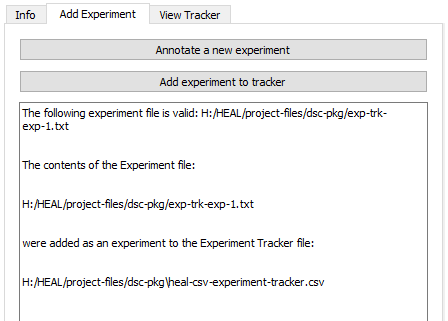

---
hide:
  - toc
full-width: true
---

# Adding an Experiment to the Experiment Tracker

1. After adding a new experiment, you will need to add it to your study's Experiment Tracker. Close the "Annotate a new experiment" window and select "Add experiment to tracker" in the "Add Experiment" tab.

    <figure markdown>
        
        <figcaption></figcaption>
    </figure>

2. When the File Explorer window pops up, navigate to the dsc-pkg folder and select the text file you want to add to the tracker. 

    1. For the first experiment added, the file name will be "exp-trk-exp-1".

    <figure markdown>
        
        <figcaption></figcaption>
    </figure>

3. A second File Explorer window will pop up prompting you to select the data package directory where the experiment tracker is saved. 

    1. This will be your dsc-pkg folder, which is the same location where your experiment text file was saved. 
    2. Select the dsc-pkg folder.
    3. Once selected, the User Status Message Box should display a confirmation message:

    <figure markdown>
        
        <figcaption></figcaption>
    </figure>

4. Navigate to your dsc-pkg folder in your File Explorer and open your Experiment Tracker file. Confirm your experiment appears in the tracker.

    * This step is not required, but it is recommended you check the tracker output after adding your first experiment to ensure the output looks correct.

    <figure markdown>
        
        <figcaption></figcaption>
    </figure>

!!! note "Viewing the Tracker"

    If you want to review your Experiment Tracker at any point, you can [view the current tracker within the tool](editexp.md) to identify whether there are errors or changes to be made.
