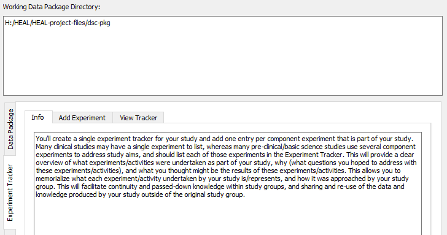
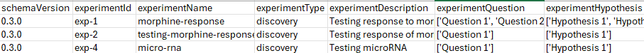

---
hide:
  - toc
full-width: true
---

# About the Experiment Tracker

{: loading=lazy width="550" align=right } This tab fills out the Experiment Tracker, which provides context on the experiments involved in the project including research questions, hypotheses, and approach. You may only have one experiment, in which case you only need to go through the process of annotating and saving your experiment to the Experiment Tracker once. However, if you have multiple experiments in your study, you will need to annotate and save each experiment to the tracker separately.

You will only have *one* Experiment Tracker for your study, with one entry per experiment. The Experiment Tracker shell that you will fill in was created and saved when you created your dsc-pkg folder.

 

*Example of an Experiment Tracker with one experiment entered:*

