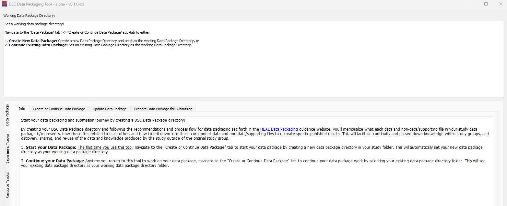
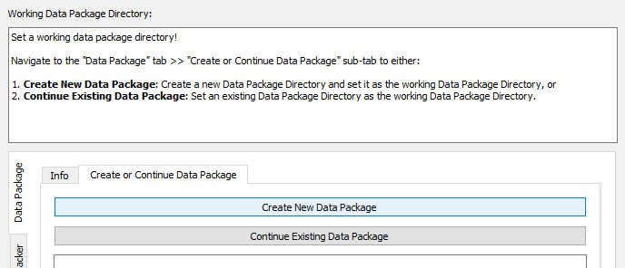

# Creating a New Data Package

The first step in creating your data package will be creating your Data Package directory. The Data Package directory is where you will save all of your data packaging documentation. The "Data Package" tab includes directions on how to create a Data Package directory.

### To create a Data Package directory:

1. Click on the "Data Package" tab. 
2. Within the "Create" tab, select "Create New Data Package".

    

3. Select the location where you want to save the Data Package directory in the File Explorer pop up window.
4. Once you select a location, the folder "dsc-pkg" will appear within that folder. The tool will also display the new folder location in the user status message box:

    

5. Your new dsc-pkg directory will contain an empty experiment tracker and resource tracker. The following steps will guide you through how to use the tool to fill out the experiment tracker, resource tracker, and results tracker (which will be created as you move through the process of entering results information).

    