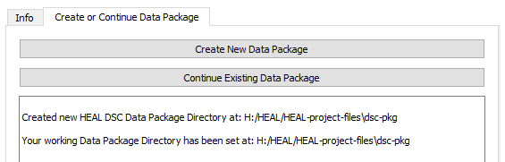
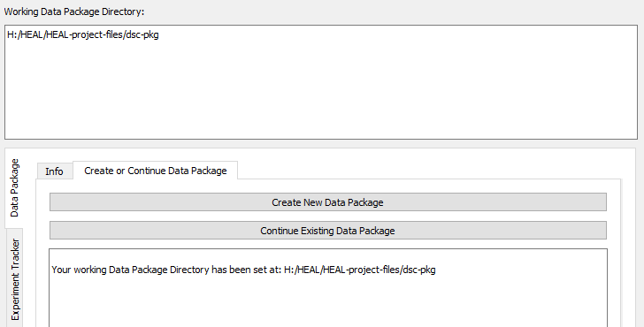

# Creating or Continuing Your Data Package

{: loading=lazy width="500" align=right } The Data Package tab will always be the first place you visit when you open the data packaging tool. The Data Package directory is where all of your data packaging documentation will live, including your study’s experiment tracker, resource tracker, results trackers, and data dictionaries.   

The first time you open the data packaging tool, you will need to create a Data Package directory. After you have created your Data Package directory, you will not need to do so again. However, each time you open the data packaging tool, you will first need to set your working data package directory (e.g., provide the path to your existing data package directory). This will enable the tool to interface with the data package folder during your session. 

Once you have created or set your working data package directory, throughout your session, the window at the top of the tool will display your working data package directory.

***
## Creating a Data Package Directory

1. Click on the "Data Package" tab. 
2. Within the "Create" tab, select "Create New Data Package".

    <figure markdown>
        
        <figcaption></figcaption>
    </figure>

3. Select the location where you want to save the Data Package directory in the File Explorer pop up window.
4. Once you select a location, the folder "dsc-pkg" will appear within that folder. The tool will also display the new folder location in the user status message box and set the dsc-pkg folder you have just created as your working data package directory for the current session:

    <figure markdown>
        
        <figcaption></figcaption>
    </figure>

5. Your new dsc-pkg directory will contain an empty experiment tracker and resource tracker. The following steps will guide you through how to use the tool to fill out the experiment tracker, resource tracker, and results tracker (which will be created as you move through the process of entering results information).

    <figure markdown>
        
        <figcaption></figcaption>
    </figure>

## Setting Your Working Data Package Directory

Although you will only need to create your data package once, you will need to set your data package working directory each time you open the tool. This will allow the tool to interface with your data packaging folder and its contents. To set your working data package directory:

1. Within the "Create or Continue Data Package Tab" select "Continue Existing Data Package."

    <figure markdown>
        
        <figcaption></figcaption>
    </figure>

2. Navigate to the data packaging directory on which you would like to work and select the folder.
3. Once you select the directory, the User Status Message Box will print out the result that your working data package directory has been set. The file path to your working data package directory will also appear in the box at the top of the tool. This path will remain at the top of the tool throughout your session.

    <figure markdown>
        
        <figcaption></figcaption>
    </figure>