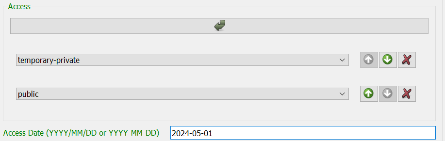
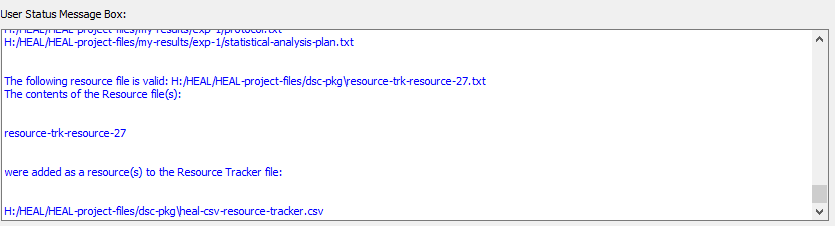

---
hide:
  - toc
full-width: true
---

# Adding a New Resource

### Getting Started

!!! info "Reminder"
    **Your first step each time you open the tool should be to set your working data package directory.** 
    
    * If you have not yet set your working data package directory this session, do so before attempting to annotate.
    * If you have not set your working package directory before attempting to annotate a resource, the tool cannot automatically generate your resource-ID or connect your resource to your data package folder. You will receive the error message below.

        

1. Navigate to the "Add Resource" tab and select "Add a new resource." 

    <figure markdown>
        
        <figcaption></figcaption>
    </figure>

2. The tool will look through your set working data package directory to determine whether there are existing annotated resource files saved in the folder and will automatically generate the next sequential Resource ID (e.g., result-1, result-2, etc.).
    1. The User Status Message Box will display a message to acknowledge this:

    <figure markdown>
        
        <figcaption></figcaption>
    </figure>

### Filling Out the Form

!!! Tip
    * For additional information about each form field, please refer to the [Resource Tracker schema](../schemas/md_resource_tracker.md)
    * Hovering over each field in the form will provide additional informaiton about what should be contained in the field. For example, for the Resource Title field:

        

1. Fill out the **Resource File Path** and **Resource Description**.
2. Select a **Resource Category**.
    1. Based on the Resource Category selected, additional fields will appear within the form.

    <figure markdown>
        
        <figcaption></figcaption>
    </figure>

***Resource Categories (and Sub-Categories)***

You can use the guide below to determine which resource category (and sub-category, if applicable) that your resource should go in.

* Note that you will need to input any Results Trackers and Data Dictionaries as well as your Experiment Tracker as resources in the Resource Tracker (as metadata).
* As noted above, additional fields will appear within the form based on the Resource Category selected. These additional fields are noted in the table below.

| Resource Category               | Sub-category                          | Additional Resource Annotation Fields |
| ------------------------------- | ------------------------------------- | ------------------------------------- |
| Multi-result | Figure Table Text Draft publication Final publication | **Associated Results Tracker**: provides the path to the Results Tracker associated with this multi-result file
| Single-result | Figure Table Text Draft publication Final publication | No additional Resource Tracker fields
| Tabular-data | Raw data Processed intermediate data Processed final data | **Resource Row Description**: explanation of what one row within the tabular file represents **Associated Data Dictionary**: file path for the data dictionary associated with the tabular file (should not be put in the Associated Files/Dependencies field) **Associated Protocol**: file path for the protocol associated with the tabular file (should not be put in the Associated Files/Dependencies field)
| Non-tabular-data | Raw data Processed intermediate data Processed final data | **Associated Protocol**: file path for the protocol associated with the tabular file (should not be put in the Associated Files/Dependencies field)
| Metadata | HEAL-formatted data dictionary Other data dictionary Protocol ID map Analysis plan HEAL-formatted results tracker HEAL-formatted experiment tracker | No additional Resource Tracker fields
| Code | No sub-categories | No additional Resource Tracker fields

Although different fields will appear for different resource categories (as discussed above), there are a few fields that will appear in every instance. They are described below:

3. **Experiment Resource 'Belongs' To**: You can define the experiment to which your resource is associated here.
    1. This option allows you to assocaite your resources directly with experimental research questions and hypotheses, which can be useful for future researchers trying to undersatnd your experiments and findings.
    2. This field pipes in all existing experiment names from the Experiment Tracker into a drop-down menu.

    <figure markdown>
        
        <figcaption></figcaption>
    </figure>  

4. **Associated Files/Dependencies**

    This is where you will list dependencies associated with the resource. How you record dependencies will depend on your annotation approach. For more information about how to decide on your annotation approach, refer to the [HEAL data packaging guidance documentation](https://norc-heal.github.io/heal-data-pkg-guide/).

    Regardless of your annotation approach, there are two ways to add "Associated Files/Dependencies" in the form.

    !!! warning

        **You should only utilize one of the below methods for entering dependencies when adding a specific result.** If you add some files as associated files/dependencies manually and then utilize the "Add Multiple Resource Dependencies" option, those files may overwrite the files you entered manually.

    1. *Single-add*: If you are adding only a few associated files/dependencies, you can add each individually using the "Associated Files/Dependencies" arrow button:

        <figure markdown>
            
            <figcaption></figcaption>
        </figure>

    2. *Multi-add*: If you would like to add many associated files at once, you can use the "Add Multiple Resource Dependencies" option, which can be found at the top of the window:

        <figure markdown>
            
            <figcaption></figcaption>
        </figure>

        1. Fill in this field with associated files/dependencies using drag and drop.
            <figure markdown>
                
                <figcaption></figcaption>
            </figure>
        2. The files you add via drag and drop will automatically appear in the "Associated Files/Dependencies" section of the form.
            <figure markdown>
                
                <figcaption></figcaption>
            </figure>

5. **Access**

    This specifies the level of access that you will apply to this resource (permanent private, temporary private, restricted access, or public).
    <figure markdown>
        
        <figcaption></figcaption>
    </figure>

    1. If you select "temporary-private," you will need to add another row and select what the level of access of the resource will be when the temporary private period ends.
        1. You will also need to fill in an "Access Date" when the temporary private period will end. This can just be a projection; you are not bound by this date.

        <figure markdown>
            
            <figcaption></figcaption>
        </figure>

6. **Software used to produce/read the resource file**: If specific or proprietary software is required to open or read the resource, you should fill this out. This will be an important characteristic of the resource tht investigators will need in order to understand how they can use the resource.

    This field is not required. If no special/proprietary software was used to produce/read the resource file, leave this field blank.

## Adding Multiple "Like" Files

If you have multiple "like" files with a similar naming convention, you may want to add and annotate them all at once rather than individually. The tool has a special feature that you can utilize to enter all "like" files at once.

#### What are "like" files?

* Examples of "like" files may be multiple datasets where each dataset is a run of the same experiments or results where each subject's data is its own dataset.
* "Like" files have the same file extension.
* To be able to use this feature in the tool, "like" files must have a similar naming convention:
    * For example, multiple data files by subject ID grouped in folders by week would be "like" files. The naming convention here is week-#/subject-#
        <figure markdown>
            
            <figcaption></figcaption>
        </figure>

    * Another example: for an experiment testing samples on multiple different dates, files could follow the naming convention sample_1_date_20230818
    * If you have "like" files, but they don't follow a common naming convention, you will need to re-name the files (under a common naming convention) in order to be able to use this feature.

To use this feature:

1. Select "Add Multiple 'like' Resources"
    <figure markdown>
        
        <figcaption></figcaption>
    </figure>

2. Drag and drop all "like" files you want to annotate together. The first of those files paths will appear in the resource file path field in the form.
    1. If your "like" files are in "like" folders (as in the above example), you can drag the folders into the box, and the tool will unpack them for you.

    <figure markdown>
        
        <figcaption></figcaption>
    </figure>

3. Once you add your "like" files, a box will pop up asking you to add a naming convention. You will need to enter a naming convention for your like files in the "Resource File Name Convention" box shown below:

    <figure markdown>
        
        <figcaption></figcaption>
    </figure>

    1. Follow the instructions in the dialog box above as to how to create a naming convention. Specifically, make sure that you use the {} brackets to bound the number, date, or descriptive information that changes from one like file to another.
    2. If your naming convention is within the directory structure (as in the above example):
        1. Copy the file path from the Resource File Path field and paste into the Resource File Name Convention box:

        <figure markdown>
        
        <figcaption></figcaption>
        </figure>

        2. Change the piece that changes from one like file to another to a descriptive name within {}. Do not remove the file extension from the path (e.g., .txt, .csv, .xlsx).

        <figure markdown>
            
            <figcaption></figcaption>
        </figure>

        3. Select "Apply Name Convention."
        4. Check the User Status Message Box to confirm that your naming convention was able to be applied.

        <figure markdown>
            
        <figcaption></figcaption>
        </figure>

        5. If you receive an error in the User Status Message Box, review your naming convention and ensure that:
            1. You have used {} to bound the changing number, date, or information that varies among your like files.
            2. You have retained the file extension in the path.
            3. Your files are actually "like" named.
        
        6. If the User Status Message Box prints a successful result, also refer to the "Resource File Description" to confirm that the naming convention was applied how you intended:
        <figure markdown>
            
            <figcaption></figcaption>
        </figure>
    
    2. If your naming convention is fully contained within the file name (e.g., file named sample_1_date_20230818):
        1. You should only include the file name in the "Resource File Name Convention" field.
        <figure markdown>
            
            <figcaption></figcaption>
        </figure>

        2. If you receive an error in the User Status Message Box, review your naming convention and ensure that:
            1. You have used {} to bound the changing number, date, or information that varies among your like files.
            2. Your files are actually "like" named.
        3. If the User Status Message Box prints a successful result, also refer to the "Resource File Description" to confirm that the naming convention was applied how you intended.

## Saving Your Resource

Once you have finished entering the resource information, select "Save resource."

!!! warning

    **Make sure you do not have your Resource Tracker open before trying to save.**

    If you attempt to save a resource but have the Resource Tracker open, the annotated resource file *will* save to your dsc-pkg folder, but the tool *will not* be able to save the information to the Resource Tracker. You will receive this error:

    <figure markdown>
        
        <figcaption></figcaption>
    </figure>

    As the printed message explains, in this case, you will have to use the "Batch add existing resource(s) to tracker" option to add this annotated resource file to the Resource Tracker.
    

1. After you select "Save resource," the User Status Message Box should display a message confirming that your resource file saved successfully and that the resource has been written to the Resource Tracker file:
    <figure markdown>
        
        <figcaption></figcaption>
    </figure>

    * This message will also include a note about all the files you listed as associated files/dependencies for your resource. This should be a helpful guide as to what resource(s) to annotate next, depending on your annotation approach.
        * If you are annotating holistically, annotate each of these files and add them as their own resource to the Resource Tracker.
        * If you are annotating minimally, annotate only the files that you will share in a public repository.

    <figure markdown>
        
        <figcaption></figcaption>
    </figure>

2. Although the tool will automatically add your resource to the Resource Tracker as part of the "save" process, your individual resource annotation file will also be saved as a .txt file within the dsc-pkg folder.

    <figure markdown>
        
        <figcaption></figcaption>
    </figure>

!!! note

    Once you have created them, you will not generally need to interact with the annotation files (.txt files) directly unless:

    1. You need to edit an existing annotated resource
    2. There is an error in automatically the resoruce to the Resource Tracker, which would necessitate manually batch adding resources to the tracker

## Next Steps

1. After you have saved your resource, you can annotate a new resource.
    1. If you would like to annotate a new resource, you can select "Clear from" at the top of the Annotate Resource window. This will reset your form and generate the next sequential resource ID, so you can start annotating a new resource.
        1. The User Status Message Box will print a message confirming your form was successfully cleared and that the new sequential ID has been generated.

        <figure markdown>
            
            <figcaption></figcaption>
        </figure>