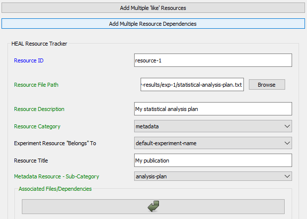
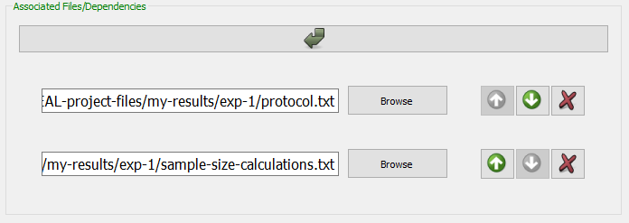

# Adding a New Resource

### Getting Started

!!! info "Reminder"
    **Your first step each time you open the tool should be to set your working data package directory.** 
    
    * If you have not yet set your working data package directory this session, do so before attempting to annotate.
    * If you have not set your working package directory before attempting to annotate a resource, the tool cannot automatically generate your resource-ID or connect your resource to your data package folder. You will receive the error message below.

        

1. Navigate to the "Add Resource" tab and select "Add a new resource." 

    <figure markdown>
        
        <figcaption></figcaption>
    </figure>

2. The tool will look through your set working data package directory to determine whether there are existing annotated resource files saved in the folder and will automatically generate the next sequential Resource ID (e.g., result-1, result-2, etc.).
    1. The User Status Message Box will display a message to acknowledge this:

    <figure markdown>
        
        <figcaption></figcaption>
    </figure>

### Filling Out the Form Fields

!!! Tip
    * For additional information about each form field, please refer to the [Resource Tracker schema](../schemas/md_resource_tracker.md){target=_blank}
    * Hovering over each field in the form will provide additional information about what should be contained in the field. For example, for the Resource Title field:

        

1. Fill out the **Resource File Path** and **Resource Description**.
2. Select a **Resource Category**.
    1. Based on the Resource Category selected, additional fields will appear within the form.

    <figure markdown>
        
        <figcaption></figcaption>
    </figure>

#### Resource Categories (and Sub-Categories)

Below is a table of all the resource category and sub-category options for your reference. The table also contains information on which fields will appear when you choose a specific category or sub-category.

| Resource Category               | Sub-category                          | Additional Resource Annotation Fields for Category |
| ------------------------------- | ------------------------------------- | ------------------------------------- |
| Multi-result | Peer-review manuscript Report White paper Presentation Poster | <ul><li>**Multi-result Resource - Sub-Category**</li><li>**Associated Results Tracker**: provides the path to the Results Tracker associated with this multi-result file; *Note that the Associated Files/Dependencies field will no longer appear.*</li>
| Single-result | Figure Table Text | <ul><li>**Single-result Resource - Sub-Category**</li>
| Tabular-data | Raw data Processed intermediate data Processed final data | <ul><li>**Resource Row Description**: explanation of what one row within the tabular file represents</li><li>**Data Resource - Sub-Category**</li><li>**Associated Data Dictionary**: file path for the data dictionary associated with the tabular file (should not be put in the Associated Files/Dependencies field)</li><li>**Associated Protocol**: file path for the protocol associated with the tabular file (should not be put in the Associated Files/Dependencies field)</li>
| Non-tabular-data | Raw data Processed intermediate data Processed final data | <ul><li>**Data Resource - Sub-Category**</li><li>**Associated Protocol**: file path for the protocol associated with the tabular file (should not be put in the Associated Files/Dependencies field)</li>
| Metadata | HEAL-formatted data dictionary Other formatted data dictionary Protocol Analysis plan HEAL-formatted results tracker HEAL-formatted experiment tracker Other | <ul><li>**Metadata Resource - Sub-Category**</li><li>*Note that if you select heal-formatted-results-tracker as the sub-category, the "Associated Files/Dependencies field will no longer appear.*</li>
| Code | No sub-categories | <ul><li>No additional Resource Tracker fields</li>

#### Experiment Resource 'Belongs' To 
1. This option allows you to associate your resources directly with experimental research questions and hypotheses, which can be useful for future researchers trying to understand your experiments and findings.
2. This field pipes in all existing experiment names from the Experiment Tracker into a drop-down menu.

    <figure markdown>
        
        <figcaption></figcaption>
    </figure>  

#### Associated Files/Dependencies

This is where you will list dependencies associated with the resource. How you record dependencies will depend on your annotation approach. For more information about how to decide on your annotation approach, refer to the [HEAL data packaging guidance documentation](https://norc-heal.github.io/heal-data-pkg-guide/){target=_blank}.

Regardless of your annotation approach, there are two ways to add "Associated Files/Dependencies" in the form.

!!! warning

    **You should only utilize one of the below methods for entering dependencies for a specific resource.** If you add some files as associated files/dependencies manually and then utilize the "Add Multiple Resource Dependencies" option, those files may overwrite the files you entered manually.

1. ***Manually adding Associated Files/Dependencies*** 

    1. If you are adding only a few associated files/dependencies, you can add each individually using the "Associated Files/Dependencies" arrow button:

    <figure markdown>
        
        <figcaption></figcaption>
    </figure>

2. ***Batch adding Associated Files/Dependencies*** 

    1. If you would like to add many associated files at once, you can use the "Add Multiple Resource Dependencies" option, which can be found at the top of the window:

    <figure markdown>
        
        <figcaption></figcaption>
    </figure>

    1. Fill in this field with associated files/dependencies using drag and drop.
        <figure markdown>
            
            <figcaption></figcaption>
        </figure>
    2. The files you add via drag and drop will automatically appear in the "Associated Files/Dependencies" section of the form.
        <figure markdown>
            
            <figcaption></figcaption>
        </figure>

#### Access

This specifies the level of access that you will apply to this resource (permanent private, temporary private, restricted access, or public).
    <figure markdown>
        
        <figcaption></figcaption>
    </figure>

1. **If you select "temporary-private,"** you will need to also denote 1) the level of access for the resource after the temporary private period and 2) the timepoint of the end of the temporary private period (Access Date). 
    1. Add an additional row and select the level of access of the resource once the temporary private period ends.
    1. Fill in the "Access Date" when the temporary private period will end. This can just be a projection; you are not bound by this date.

    <figure markdown>
        
        <figcaption></figcaption>
    </figure>

2. For other access levels, you will not need to complete these additional steps.

#### Software used to produce/read the resource file

If specific or proprietary software is required to open or read the resource, you should fill this out.

This field is not required. If no special/proprietary software was used to produce/read the resource file, leave this field blank.

## Adding Multiple "Like" Files

If you have multiple "like" files with a similar naming convention, you may want to add and annotate them all at once rather than individually. The tool has a special feature that you can utilize to annotate multiple "like" files all at once.

### What are "like" files?

1. Examples of "like" files may be multiple datasets where each is a run of the same set of experiments or experimental results where each dataset corresponds to one subject's data. "Like" files will also have the same file extension.
2. To be able to use this feature in the tool, "like" files must follow a common naming convention:
    1. For example, multiple data files by subject ID grouped in folders by week would be "like" files. The naming convention here is week-#/subject-#
        <figure markdown>
            
            <figcaption></figcaption>
        </figure>

    2. Another example: for an experiment testing samples on multiple different dates, files could follow the naming convention sample_1_date_20230818, sample_2_date_20230818, etc.
    3. If you have "like" files, but they don't follow a common naming convention, you will need to re-name the files (using a common naming convention) in order to be able to use this feature.

If you have determined that you have a set of 'like' resources that you would like to annotate all at once, follow the steps below.

### How to add multiple "like" files

1. Select "Add Multiple 'like' Resources"
    <figure markdown>
        
        <figcaption></figcaption>
    </figure>

2. Drag and drop all "like" files you want to annotate together. The first of those files paths will appear in the "Resource File Path" field in the form.
    1. If your "like" files are in "like" folders (as in the above example of week-#/subject-# structure), you can drag the folders into the box, and the tool will unpack them for you.

    <figure markdown>
        
        <figcaption></figcaption>
    </figure>

3. Once you add your "like" files, a box will pop up asking you to add a naming convention. You will need to enter a naming convention for your like files in the "Resource File Name Convention" box shown below:

    <figure markdown>
        
        <figcaption></figcaption>
    </figure>

    1. Follow the instructions in the dialog box above as to how to create a naming convention. Specifically, make sure that you use the {} brackets to bound the number, date, or descriptive information that changes from one like file to another.
        1. Your will specify your naming convention slightly differently depending on whether it is integrated within the directory structure (e.g., multiple data files by subject ID grouped in folders by week) or within the filename (e.g., multiple data files within the same directory that only differ by filename).

    2. **If your naming convention is within the directory structure**:
        1. Copy the file path from the Resource File Path field and paste into the Resource File Name Convention box:

            <figure markdown>
            
            <figcaption></figcaption>
            </figure>

        2. Change the piece that changes from one like file to another to a descriptive name within {}. Do not remove the file extension from the path (e.g., .txt, .csv, .xlsx).

            <figure markdown>
                
                <figcaption></figcaption>
            </figure>

        3. Select "Apply Name Convention."
        4. Check the User Status Message Box to confirm that your naming convention was able to be applied.

            <figure markdown>
                
            <figcaption></figcaption>
            </figure>

        5. If you receive an error in the User Status Message Box, review your naming convention and ensure that:
            1. You have used {} to bound the changing number, date, or information that varies among your like files.
            2. You have retained the file extension in the path.
            3. Your files are actually "like" named.
        
        6. If the User Status Message Box prints a successful result, also refer to the "Resource File Description" to confirm that the naming convention was applied how you intended:
        <figure markdown>
            
            <figcaption></figcaption>
        </figure>
    
    2. **If your naming convention is fully contained within the file name**:
        1. You should only include the file name in the "Resource File Name Convention" field (rather than the file path).
        <figure markdown>
            
            <figcaption></figcaption>
        </figure>

        2. Select "Apply Name Convention."
        3. Check the User Status Message Box to confirm that your naming convention was able to be applied.
            <figure markdown>
                
                <figcaption></figcaption>
            </figure>
        2. If you receive an error in the User Status Message Box, review your naming convention and ensure that:
            1. You have used {} to bound the changing number, date, or information that varies among your like files.
            2. Your files are actually "like" named.
        3. If the User Status Message Box prints a successful result, also refer to the "Resource File Description" to confirm that the naming convention was applied how you intended.

            <figure markdown>
                
                <figcaption></figcaption>
            </figure>

## Saving Your Resource

Once you have finished entering the resource information, select "Save resource."

!!! warning

    **Make sure you do not have your Resource Tracker open before trying to save.**

    If you attempt to save a resource but have the Resource Tracker open, the annotated resource file *will* save to your dsc-pkg folder, but the tool *will not* be able to save the information to the Resource Tracker. You will receive this error:

    <figure markdown>
        
        <figcaption></figcaption>
    </figure>

    As the printed message explains, in this case, you will have to use the ["Batch add existing resource(s) to tracker"](batchreso.md) option to add this annotated resource file to the Resource Tracker.
    

1. After you select "Save resource," the User Status Message Box should display a message confirming that your resource file saved successfully and that the resource has been written to the Resource Tracker file:
    <figure markdown>
        
        <figcaption></figcaption>
    </figure>

    1. This message will also include a note about all the files you listed as associated files/dependencies for your resource. Each of these dependencies will also need to be documented as a resource. 
        1. To make this process easier, these files will automatically be pulled into a resource list, which you can access via the ["Check Resources to Add"](checkresource.md) tab. 
        2. You will be able to use the "Check Resources to Add" tab to directly select and document specific resources from the list.

    <figure markdown>
        
        <figcaption></figcaption>
    </figure>

2. Although the tool will automatically add your resource to the Resource Tracker as part of the "save" process, your individual resource annotation file will also be saved as a .txt file within the dsc-pkg folder.

    <figure markdown>
        
        <figcaption></figcaption>
    </figure>

!!! note

    Once you have created them, you will not generally need to interact with the annotation files (.txt files) directly unless:

    1. You need to [edit an existing annotated resource](editresource.md)
    2. There was an error in automatically adding the resource to the Resource Tracker, which would necessitate manually [batch adding resources to the tracker](batchreso.md)

## Next Steps

1. After you have saved your resource, you can annotate a new resource.
    1. If you would like to annotate a new resource, you can select "Clear form" at the top of the Annotate Resource window. This will reset your form and generate the next sequential resource ID, so you can start annotating a new resource.
        1. The User Status Message Box will print a message confirming your form was successfully cleared and that the new sequential ID has been generated.

        <figure markdown>
            
            <figcaption></figcaption>
        </figure>