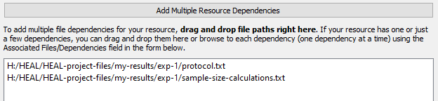

# Adding a New Resource

1. Navigate to the "Add Resource" tab and select "Annotate a new resource."

    <figure markdown>
        
        <figcaption></figcaption>
    </figure>

2. Select "Add DSC Package Directory." Navigate to your dsc-pkg folder and click "Select FOlder." This will set your resource to be saved to the tracker. This also detects and automatically inputs the next sequential Resource ID (e.g., resource-1, resource-2, etc.).
    1. This step is necessary, as you will not be able to save a resource until you specify the location of your DSC package directory.

    <figure markdown>
        
        <figcaption></figcaption>
    </figure>

3. Fill out the corresponding fields. Based on your selection for "Resource Category," different options will appear in the form.

    <figure markdown>
        
        <figcaption></figcaption>
    </figure>

## Resource Fields
#### Resource Categories (and Sub-Categories)

You can use the guide below to determine which resource category (and sub-category, if applicable) that your resource should go in.

* Note that you will need to input any Results Trackers and Data Dictionaries as well as your Experiment Tracker as resources in the Resource Tracker (as metadata).

| Resource Category               | Sub-category                          |
| ------------------------------- | ------------------------------------- |
| Multi-result | Figure Table Text Draft publication Final publication |
| Single-result | Figure Table Text Draft publication Final publication |
| Tabular-data | Raw data Processed intermediate data Processed final data |
| Non-tabular-data | Raw data Processed intermediate data Processed final data |
| Metadata | HEAL-formatted data dictionary Other data dictionary Protocol ID map Analysis plan HEAL-formatted results tracker HEAL-formatted experiment tracker |
| Code | No sub-categories |

1. Certain Resource Category selections will result in additional fields (beyond sub-category) appearing in the form. For information about these category-specific fields, see below:

    1. Multi-result file
        1. "Associated Results Tracker": provide the path to the results tracker assocaited with this multi-result file.
            1. For more information on the Results Tracker, [click here](../resulttrack/index.md).

    2. Tabular-data file
        1. "Resource Row Description": explanation of what one row within the tabular data file represents (e.g., one row represents one subject at one timepoint)
        2. "Associated Data Dictionary" and "Associated Protocol": this is where you should put the data dictionary and protocol associated with the tabular data file, not in the "Associated Files/Dependencies" field.
    
    3. Non-tabular-data file
        1. "Associated Protocol": this is where you should put the protocol associated with the non-tabular data file (if applicable); do not put the associated protocol in the "Associated FIles/Dependencies" field.

Although different fields will appear for different resource categories (as discussed above), there are a few fields that will appear in every instance. They are described below:

#### Associated Files/Dependencies

This is where you will list dependencies associated with the resource. How you record dependencies will depend on your annotation approach:

    LEAVING BLANK BECAUSE WE ARE DISCUSSING ANNOTATION APPROACHES CURRENTLY

1. Regardless of your annotation approach, ther eare two ways to add "Associated Files/Dependencies" in the form:

    1. If you are adding only a few associated files/dependencies, you can add each individually using the "Associated Files/Dependencies" arrow button:

    <figure markdown>
        
        <figcaption></figcaption>
    </figure>

    2. If you would like to add many associated files at once, you can use the "Add Multiple Resource Dependencies," which can be found at the top of the window:

        <figure markdown>
            
            <figcaption></figcaption>
        </figure>

        1. Fill in this field with associated files/dependencies using drag and drop.

            <figure markdown>
            
            <figcaption></figcaption>
            </figure>
        
        2. The files you add via drag and drop will automatically appear in the "Associated Files/Dependencies" section of the form:

            <figure markdown>
            
            <figcaption></figcaption>
            </figure>

#### Access

This specifies the level of access that you will apply to this resource (permanent private, temporary private, restricted access, or public).
    <figure markdown>
        
        <figcaption></figcaption>
    </figure>

1. If you select "temporary-private," you will need to add another row and select what the level of access of the resource will be when the temporary private period ends.
    1. You will also need to fill in an "Access Date" when the temporary private period will end. This can just be a projection; you are not bound by this date.

    <figure markdown>
        
        <figcaption></figcaption>
    </figure>

#### Software used to produce/read the resource file

If specific or proprietary software is required to open or read the resource, you should fill this out. This will be an important characteristic of the resource tht investigators will need in order to understand how they can use the resource.

This field is not required. If no special/proprietary software was used to produce/read the resource file, leave this field blank.

## Adding Multiple "Like" Files

If you have multiple "like" files with a similar naming convention, you may want to add and annotate them all at once rather than individually. The tool has a special feature that you can utilize to enter all "like" files at once.

#### What are "like" files?

* Examples of "like" files may be multiple datasets where each dataset is a run of the same experiments or results where each subject's data is its own dataset.
* "Like" files have the same file extension.
* To be able to use this feature in the tool, "like" files must have a similar naming convention:
    * For example, multiple data files by subject ID grouped in folders by week would be "like" files. The naming convention here is week-#/subject-#
    <figure markdown>
        
        <figcaption></figcaption>
    </figure>

    * Another example: for an experiment testing samples on multiple different dates, files could follow the naming convention sample_1_date_20230818
    * If you have "like" files, but they don't follow a common naming convention, you will need to re-name the files (under a common naming convention) in order to be able to use this feature.

To use this feature:

1. Select "Add Multiple 'like' Resources"
    <figure markdown>
        
        <figcaption></figcaption>
    </figure>

2. Drag and drop all "like" files you want to annotate together. The first of those files paths will appear in the resource file path field in the form.
    1. If your "like" files are in "like" folders (as in the above example), you can drag the folders into the box, and the tool will unpack them for you.

    <figure markdown>
        
        <figcaption></figcaption>
    </figure>

3. Once you add your "like" files, a box will pop up asking you to add a naming convention. You will need to enter a naming convention for your like files in the "Resource File Name Convention" box shown below:

    <figure markdown>
        
        <figcaption></figcaption>
    </figure>

    1. Follow the instructions in the dialog box above as to how to create a naming convention. Specifically, make sure that you use the {} brackets to bound the number, date, or descriptive information that changes from one like file to another.
    2. If your naming convention is within the directory structure (as in the above example):
        1. Copy the file path from the Resource File Path field and paste into the Resource File Name Convention box:

        <figure markdown>
        
        <figcaption></figcaption>
        </figure>

        2. Change the piece that changes from one like file to another to a descriptive name within {}. Do not remove the file extension from the path (e.g., .txt, .csv, .xlsx).

        <figure markdown>
            
            <figcaption></figcaption>
        </figure>

        3. Select "Apply Name Convention."
        4. Check the User Status Message Box to confirm that your naming convention was able to be applied.

        <figure markdown>
            
        <figcaption></figcaption>
        </figure>

        5. If you receive an error in the User Status Message Box, review your naming convention and ensure that:
            1. You have used {} to bound the changing number, date, or information that varies among your like files.
            2. You have retained the file extension in the path.
            3. Your files are actually "like" named.
        
        6. If the User Status Message Box prints a successful result, also refer to the "Resource File Description" to confirm that the naming convention was applied how you intended:
        <figure markdown>
            
            <figcaption></figcaption>
        </figure>
    
    2. If your naming convention is fully contained within the file name (e.g., file named sample_1_date_20230818):
        1. You should only include the file name in the "Resource File Name Convention" field.
        <figure markdown>
            
            <figcaption></figcaption>
        </figure>

        2. If you receive an error in the User Status Message Box, review your naming convention and ensure that:
            1. You have used {} to bound the changing number, date, or information that varies among your like files.
            2. Your files are actually "like" named.
        3. If the User Status Message Box prints a successful result, also refer to the "Resource File Description" to confirm that the naming convention was applied how you intended.

## Saving Your Resource

After filling out the form for your resource, click "Save resource." The User Status Message Box should display a message confirming that your resource file was written to your dsc-pkg folder:
    <figure markdown>
        
        <figcaption></figcaption>
    </figure>

* This message will alos include a note about all the files you listed as associated files/dependencies for your resource. This should be a helpful guide as to what resource(s) to annotate next, depending on your annotation approach.
    * If you are annotating holistically, annotate each of these files and add them as their own resource to the Resource Tracker.
    * If you are annotating minimally, annotate only the files that you will share in a public repository.