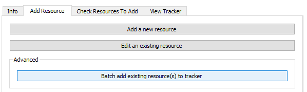
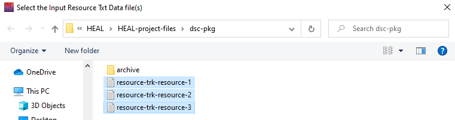
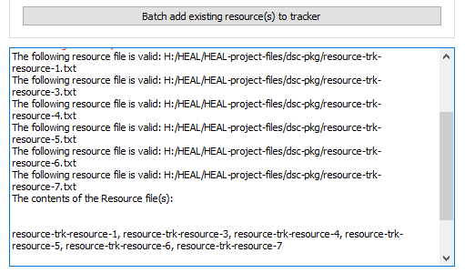

# Advanced

## Batch Add Resource(s) to Tracker

If you try to save a resource while you have the Resource Tracker open, you will receive an error. The annotated resource file will save as a .txt file within the dsc-pkg folder, but it will not be added to the Resource Tracker. You will need to add this resource manually using the "Batch add existing resource(s) to tracker" option.

1. Ensure that your Resource Tracker is not open before attempting to batch add resources.
2. Navigate to the "Add Resource" tab and select "Batch add existing resource(s) to tracker" under "Advanced."

    <figure markdown>
        
        <figcaption></figcaption>
     </figure>

3. Select the resources that you want to add.
    1. It may be easiest to select all existing annotated resource files when using this feature. The tool will scan the resource files you select and only add those that are not already included within the Resource Tracker, so selecting a file that has already been included in the Resource Tracker will not produce an error here.
    2. Note: Resource annotation txt files follow the naming convention "resource-trk-resource-"

    <figure markdown>
        
        <figcaption></figcaption>
     </figure>

4. If your files are successfully added to the Resource Tracker, the User Status Message Box will provide a confirmation message:

    <figure markdown>
        
        <figcaption></figcaption>
     </figure>