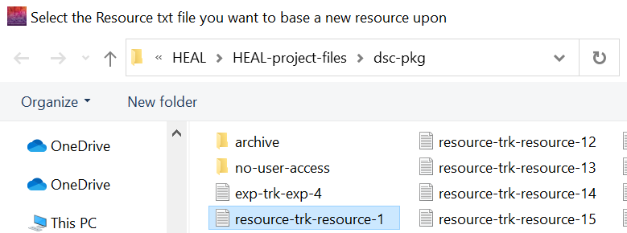
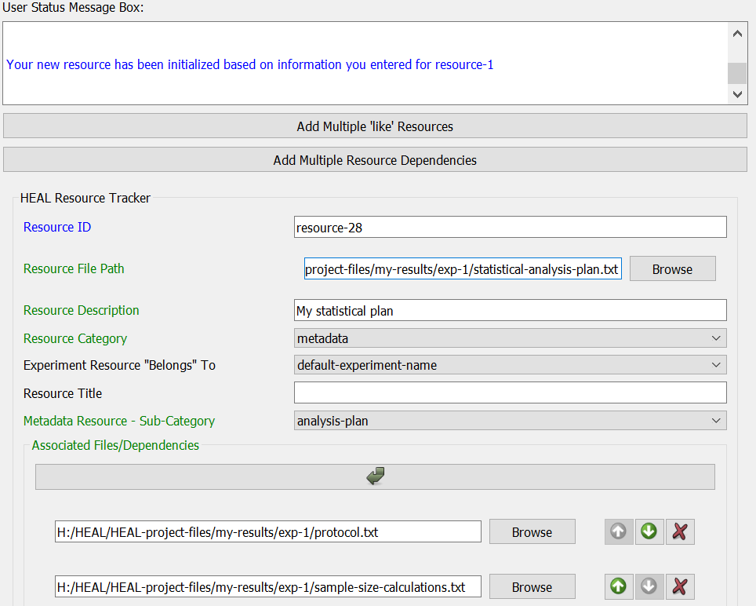
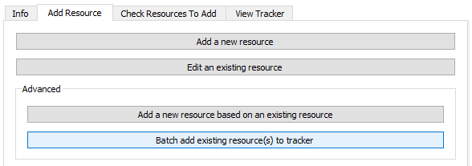

# Advanced

## Add a New Resource Based on an Existing Resource

If you need to annotate a resource that is very similar to a previously annotated resource, with only small changes, you may want to use the "Add a new resource based on an existing resource" option. 

With this feature, you will select a previously annotated resource, and the tool will copy the information from the chosen resource into a new resource annotation form with a unique resource-ID. You will then only need to edit the information rather than reproduce it.

1. Select "Add a new resource based on an existing resource."

    <figure markdown>
        
        <figcaption></figcaption>
    </figure>

2. Your working data package folder will open automatically. Select the resource on which you want to base your new resource annotation. 

    <figure markdown>
        
        <figcaption></figcaption>
    </figure>

3. The annotate resource form will open and populate with the selected resource information with a unique ID.

    <figure markdown>
        
        <figcaption></figcaption>
    </figure>

4. Edit the form to reflect the differences in this new resource. Save the form.

## Batch Add Resource(s) to Tracker

If you try to save a resource while you have the Resource Tracker open, you will receive an error. The annotated resource file will save as a .txt file within the dsc-pkg folder, but it will not be added to the Resource Tracker. You will need to add this resource manually using the "Batch add existing resource(s) to tracker" option.

1. Ensure that your Resource Tracker is not open before attempting to batch add resources.
2. Navigate to the "Add Resource" tab and select "Batch add existing resource(s) to tracker" under "Advanced."

    <figure markdown>
        
        <figcaption></figcaption>
     </figure>

3. Select the resources that you want to add.
    1. It may be easiest to select all existing annotated resource files when using this feature. The tool will scan the resource files you select and only add those that are not already included within the Resource Tracker, so selecting a file that has already been included in the Resource Tracker will not produce an error here.
    2. Note: Resource annotation txt files follow the naming convention "resource-trk-resource-"

    <figure markdown>
        
        <figcaption></figcaption>
     </figure>

4. If your files are successfully added to the Resource Tracker, the User Status Message Box will provide a confirmation message:

    <figure markdown>
        
        <figcaption></figcaption>
     </figure>