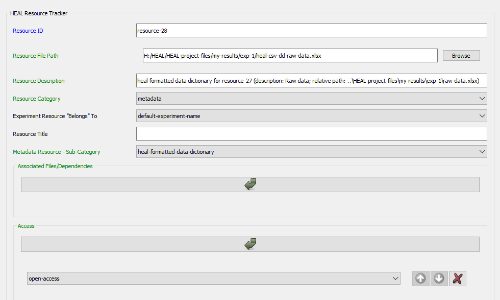

---
hide:
  - toc
full-width: true
---

# Check Resources to Add

## Purpose

{: loading=lazy width="550" align=right }As you document each resource, you will enter dependencies. After a file is listed as a dependency, it will need to be documented as a resource. This allows for future investigators to understand what files underlie the results. The "Check Resources to Add" tab is designed make this process easier. 

Whenever you document a resource and add dependencies, the tool will pull any of those dependencies that have not yet been documented into a resource list. When you load the resource list, you will be able to view all resources (that have been added as dependencies) left to annotate. You will also be able to select and annotate remaining resources from this window.

If you are using a minimal annotation standard, you will also be able to designate whether you are planning to share each resource within the list. If you are not planning to share a resource, you will be able to complete a "rapid audit" for that resource instead of providing full documentation. This will allow even those resources that will not be shared to have at least minimal descriptive information.

***

## Loading the Resource List

1. Once you have documented one or more resources and their dependencies in the "Add Resource" tab, you will be able to view those dependencies in the Resource List. Navigate to the "Check Resources to Add" tab. Select "Load Resource List."

     <figure markdown>
        
        <figcaption></figcaption>
    </figure>

    1. Note the user status message box above: **Each time you add a resource, you should re-load your resource list using the "Load Resource List" push-button**. This will remove the resource you have just annotated and add any new dependencies documented.

2. When you open the "Load Resource List" window, you will find a list of all resources that have been added as dependencies, including the relative path, the type of dependency, the parent resource, and an option to "add resource to tracker."

     <figure markdown>
        
        <figcaption></figcaption>
    </figure>

**If you are loading your resource list for the first time:**

2. You will need to respond to **two questions**: 1) how you would like the file paths to be displayed in the resource list and 2) whether you have chosen a minimal annotation standard. 
    1. Note that after you have selected your preferences for these two questions, the tool will save them, so you will not have to re-select them each time you load your resource list.

     <figure markdown>
        
        <figcaption></figcaption>
    </figure>

    1. Question 1 is fairly simple and just a matter of preference as to how you would like to view the file paths as you are using this tab in the tool. You can choose to display file paths as full paths or as relative paths, relative to your working data package directory.
    2. Question 2 asks you whether you have chosen a minimal annotation standard due to a low level of resources available to devote to data sharing. 
        1. If you need a refresher on how to answer this question, please refer to the [conceptual best practices guidance documentation](https://norc-heal.github.io/heal-data-pkg-guide/){target=_blank}.
        2. If you select this option, an additional column will appear within the resource list: "Share resource?"

            <figure markdown>
                
                <figcaption></figcaption>
            </figure>

            1. Since you are following a minimal annotation standard, you will only fully document the files that you are sharing in your shareable data package.
            2. Deselect the checkboxes corresponding to resources you will not share publicly in a repository.
                1. By default, all resources will be selected for sharing. You must deselect the resources that you are not planning to share.
                3. Once a resource is deselected, the option to "rapidly audit" the resource will appear. This "rapid audit" form will be a modified version of the full resource annotation form, requiring only minimal information be provided.

                <figure markdown>
                    
                    <figcaption></figcaption>
                </figure>

## Adding a Resource from the Resource List

You can annotate resources directly from the resource list, rather than returning to the Add Resource tab to add them. There are two methods for adding resources, add resource to tracker and rapid audit resource. Which method is used will depend on whether the resource will be shared in a repository. 

* **If you *are not* using a minimal annotation standard**: You will only use the ["Add resource to tracker"](#add-resource-to-tracker) option. 
* **If you *are* using a minimal annotation standard**: You will use the ["Add resource to tracker"](#add-resource-to-tracker) option for those resources that will be shared in a repository and ["Rapid audit resource"](#rapid-audit-resource) for those resources that will not be shared in a repository.

### Add Resource to Tracker

1. You can annotate a resource directly from the resource list, rather than returning to the "Add Resource" tab. To annotate a resource within the resource list, select "Add resource to tracker."

    <figure markdown>
        
        <figcaption></figcaption>
    </figure>

2. This will open the same "Annotate Resource" window that you would find if you annotated a new resource via the "Add Resource" tab. For a refresher on how to fill out this form, refer to the [instructions on adding a new resource](addresource.md).
    1. In the example below, the resource being annotated had been added as an associated data dictionary for resource-5. The tool extracted this information and pre-filled some fields in the resource form automatically. 
    <figure markdown>
        
        <figcaption></figcaption>
    </figure>

    2. For other associated files/dependencies, the tool will only pre-fill the resource file path.
    <figure markdown>
        
        <figcaption></figcaption>
    </figure>

3. Fill in the form as usual, including adding the associated files/dependencies.

    <figure markdown>
        
        <figcaption></figcaption>
    </figure>

4. Save the resource, and close the form.
5. Return to the "Check Resources to Add" tab and select "Load Resource List" to refresh the list. 
    1. The resource you have just annotated will be removed from the refreshed list, and any newly added dependencies will appear. 
    2. In the example, below although the cohort file, raw data, and statistical analysis plan were all added as dependencies for resource-6 (documented above), only the cohort file has been added to the resource list upon refresh. The statistical analysis plan has already been documented, so it does not appear, and the raw data was already listed as a dependency of resource-5.

    <figure markdown>
        
        <figcaption></figcaption>
    </figure>

6. Repeat these steps until you have annotated all resources in the resource list.

### Rapid Audit Resource

1. If you have chosen a minimal annotation standard due to a low level of reosurces available to devote to data sharing, ensure that you have selected the checkbox in the optional section in the "Check Resources to Add" tab.
    1. Review the resource list and deselect any resources that you will not be sharing under "Share resource?" You will then be given the option to rapid audit these resources.

    <figure markdown>
        
        <figcaption></figcaption>
    </figure>

2. For resources that you will not share, select the "Rapid audit resource" option. You will be presented with a pared down version of the "Annotate Resource" form. As in the normal resource annotation form, additional fields may appear based on the "Resource Category."

    <figure markdown>
        
        <figcaption></figcaption>
    </figure>

3. Fill in the form, including any associated files/dependencies.
    1. Note that because the resource being annotated here is a tabular file, the associated data dictionary and associated protocol fields have also popped up.

    <figure markdown>
        
        <figcaption></figcaption>
    </figure>

4. Save the resource, and close the form.
5. Return to the "Check Resources to Add" tab and select "Load Resource List" to refresh the list. 
    1. The resource you have just annotated will be removed from the refreshed list, and any newly added dependencies will appear. 
    2. Each new resource added to the list will automatically be assumed to be shared, so it is important to also review the updated resource list and ensure that all resources that will not be shared are deselected under "Share resource?"

    <figure markdown>
        
        <figcaption></figcaption>
    </figure>

6. Repeat these steps annotating all resources that will not be shared in a repository using the "Rapid audit resource" feature. As a reminder, when documenting resources that *will* be shared, use the ["Add resource to tracker"](#add-resource-to-tracker) feature detailed above.