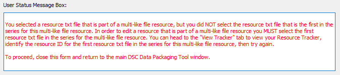

# Editing an Existing Resource

If you want to edit a resource after you have created it, you can do so in the tool using the "Edit an existing resource" feature.

!!! info

    We encourage you to use the tool to edit your resources rather than entering/editing information manually into the Resource Tracker CSV, as the tool will automatically put your information into the correct formatting and structure. Manual edits will not necessarily be in the correct format.

1. Select "Edit existing resource" in the "Add Resource" tab.

    <figure markdown>
        
        <figcaption></figcaption>
    </figure>  

2. Your dsc-pkg folder will open in File Explorer. Select the anntotated resource .txt file that you want to edit.

    *For example*:
    <figure markdown>
        
        <figcaption></figcaption>
    </figure>  

3. The information on your annotated resource will populate in the "Annotate Resource" window.

    <figure markdown>
        
        <figcaption></figcaption>
    </figure> 

4. Make any necessary edits to your resource file, and then select "Save resource."
    1. When you save your edited resource, the tool will archive the original version of your resource annotation (.txt) file in an "archive" folder, so there are no issues with duplicate file naming.

    <figure markdown>
        
        <figcaption></figcaption>
    </figure> 

## Editing Multiple "Like" Resources

If you have annotated multiple "like" files at once using the "Add Multiple 'like' Resources" option, you can also edit them as a group using the "Edit an existing resource" feature. You cannot edit individual resources that were added as a set of multiple "like" files.

1. If you would like to edit a multi-like file resource, select the resource txt file that is **first** in the series of annotated multiple-like file resources. For example, if you annotated 3 files as multiple 'like' resources, and the corresponding resource txt files created were the three files in the image below, you would want to select to edit resource-trk-resource-29.

    <figure markdown>
        
        <figcaption></figcaption>
    </figure> 

    1. If you select a resource that is not the first txt file in that series of annotated multiple 'like' files (in the above example, resource-trk-resource-29), you will receive an error in the User Status Message Box (below) instructing you to return to the edit option and select the first resource in the series.

        <figure markdown>
            
            <figcaption></figcaption>
        </figure> 

2. The information on your annotated resource will population in the "Annotate Resource" window.

    <figure markdown>
        
        <figcaption></figcaption>
    </figure> 

3. Make any necessary edits to your multi 'like' resources, and then select "Save resource."
    1. When you save your edited resource, the tool will archive the original versions of your multi 'like' resource annotation (.txt) files in an "archive" folder, so there are no issues with duplicate file naming.

