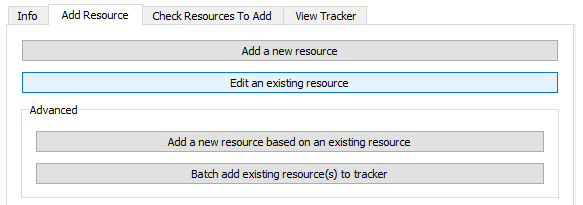
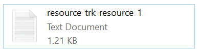

# Editing an Existing Resource

If you want to edit a resource after you have created it, you can do so in the tool using the "Edit an existing resource" feature.

!!! info

    We encourage you to use the tool to edit your resources rather than entering/editing information manually into the Resource Tracker CSV, as the tool will automatically put your information into the correct formatting and structure. Manual edits will not necessarily be in the correct format.

1. Select "Edit existing resource" in the "Add Resource" tab.

    <figure markdown>
        
        <figcaption></figcaption>
    </figure>  

2. Your dsc-pkg folder will open in File Explorer. Select the anntotated resource .txt file that you want to edit.

    *For example*:
    <figure markdown>
        
        <figcaption></figcaption>
    </figure>  

3. The information on your annotated resource will population in the "Annotate Result" window.

    <figure markdown>
        
        <figcaption></figcaption>
    </figure> 

    1. When you edit your first resource, the tool will create an "archive" folder and will archive the original version of your resource annotation (.txt) file there, so there are no issues with duplicate file naming. The User Status Message Box will also display a message providing information on the location of the original annotation file (see example above).

    <figure markdown>
        
        <figcaption></figcaption>
    </figure> 

4. Make any necessary edits to your resource file, and then select "Save resource."
