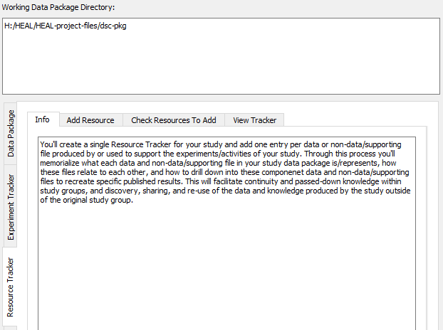

---
hide:
  - toc
full-width: true
---

# About the Resource Tracker

{: loading=lazy width="550" align=right }This tab creates the resource tracker, which provides an annotated inventory of all resources involved in the study. The depth and extent of information included in the resource tracker will be determined how you want to share data and how you want to annotate the data you share. For help in making these decisions, refer to the best practices guidance. The best practices guidance will provide information on how you should fill out each tracker based on your chosen annotation approach.

You will only have one resource tracker for your study, with one entry per data or non-data/supporting file. The resource tracker shell that you will fill in was created and saved when you created your dsc-pkg folder.