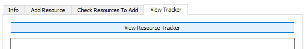
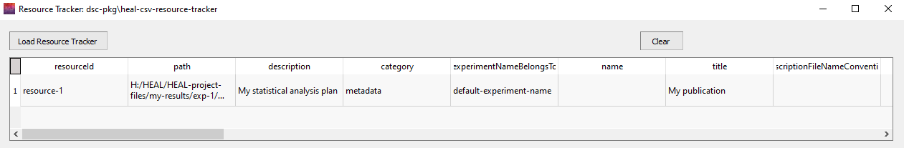

# Viewing the Resource Tracker

If you need to view anything that you have already input into the Resource Tracker, you can use the "View Tracker" feature. It may be useful to view your Resource Tracker within the application to:

* Review which individual resources you have already annotated and determine which you still need to annotate.
* Find/confirm the resource ID for a particular result to determine where edits need to be made when there has been a change.

---

1. Navigate to "View Tracker" on the Resource Tracker tab. Select "View Resource Tracker."

    <figure markdown>
        
        <figcaption></figcaption>
    </figure> 

2. The window below will pop up. Select "Load Resource Tracker."
    1. Your Resource Tracker will populate in the window.

    <figure markdown>
        
        <figcaption></figcaption>
    </figure> 
