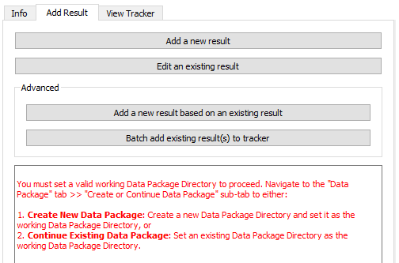
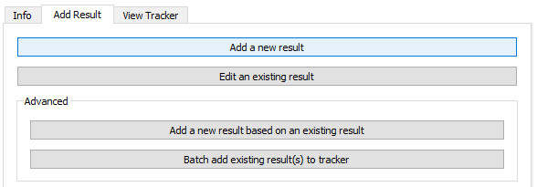
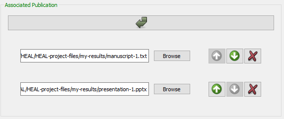
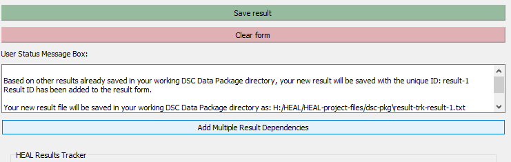
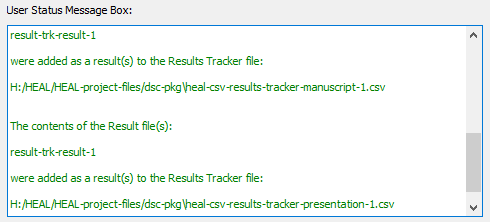

# Adding a New Result

### Getting Started

!!! info "Reminder"
    **Your first step each time you open the tool should be to set your working data package directory.** 
    
    * If you have not yet set your working data package directory this session, do so before attempting to annotate.
    * If you have not set your working package directory before attempting to annotate a result, the tool cannot automatically generate your result-ID or connect your result to your data package folder. You will receive the error message below.

        

1. Navigate to the "Add Results" tab and select "Add a new result."
    
    <figure markdown>
        
        <figcaption></figcaption>
    </figure>

2. The tool will look through your set working data package directory to determine whether there are existing annotated results files saved in the folder and will automatically generate the next sequential Result ID (e.g., result-1, result-2, etc.).
    1. The User Status Message Box will display a message to acknowledge this:

    <figure markdown>
        
        <figcaption></figcaption>
    </figure>

    
### Filling Out the Form

!!! Tip
    * For additional information about each form field, please refer to the [Results Tracker schema](../schemas/md_results_tracker.md).
    * Hovering over each field in the form will provide additional information about what should be contained within the field. For example, for the Result Category field:
        

2. Fill out a short **Result Description.**

    <figure markdown>
        
        <figcaption></figcaption>
    </figure>

#### Result Category
1. Based on the Result Category selected, additional questions will appear within the form.

    <figure markdown>
        
        <figcaption></figcaption>
    </figure>

#### Experiment Result 'Belongs' To
1. This option allows you to associate your results directly with experimental research questions and hypotheses, which can be useful for future researchers trying to understand your experiments and findings. 
2. This field pipes in all existing experiment names from the Experiment Tracker into a drop-down menu.

     <figure markdown>
        
        <figcaption></figcaption>
    </figure>  

#### Associated Publication
1. If this figure is already part of a manuscript, poster, or other publication, you will provide the path for that publication here. If your figure is not currently associated with a publication, you can leave this field blank for now. Once this result is included within a publication, you should return to [edit the result annotation](editresult.md) to fill in the associated publication field for this result. 

    To add an associated publication, select the arrow below the field:
    <figure markdown>
        
        <figcaption></figcaption>
    </figure>
        
2. *If the result is associated with multiple publications*, select the arrow again and enter the paths to each of the publication files here. This will allow the tool to create a results tracker for each of those publications in future steps (or add the individual result to the right results trackers), all of which will be associated with this result.
    <figure markdown>
        
        <figcaption></figcaption>
    </figure>

#### Figure Number/Table Number
1. If you selected "Figure" or "Table" within "Result Category," you will need to provide a corresponding figure/table number for each "Associated Publication."
1. Click on the arrow to insert each figure/table number. 
    1. Ensure that the figure/table numbers are in the same order as the corresponding publications. You can adjust the order using the green up and down arrows.
        
        <figure markdown>
            
            <figcaption></figcaption>
        </figure>
        
#### Associated Files/Dependencies
This is where you will list dependencies for the result. How you record dependencies will depend on your annotation approach. For more information about how to decide on your annotation approach, refer to the [HEAL data packaging guidance documenation](https://norc-heal.github.io/heal-data-pkg-guide/){target=_blank}. 

Regardless of your annotation approach, there are two ways to add "Associated Files/Dependencies," manually or via batch add. See below for descriptions of each.

!!! Warning

    **You should only utilize one of the below methods for entering dependencies when adding a specific result.** If you add some files as associated files/dependencies manually and then utilize the "Add Multiple Results Dependencies" option, those files may overwrite the files you entered manually.

1. ***Manually adding Associated Files/Dependencies***

    1. If you are adding only a few associated files/dependencies, you can add each row individually using the arrow button:

        

2. ***Batch adding Associated Files/Dependencies***

    1. If you would like to add many associated files at once, you can use the "Add Multiple Results Dependencies" option, which can be found at the top of the "Add Results" window:

        

        1. Fill in this field with associated files/dependencies using drag-and-drop from your file explorer.

        

        2. The files you drag and drop will automatically appear in the "Associated Files/Dependencies" section in the form.

        

#### Result Supports
This describes the larger claim that the result is used to support in the publication. This is not required but can be very useful for data reuse and interpretation for future researchers.

### Saving Your Result

1. When you are done filling out the form, select "Save result."

    !!! warning

        **Make sure that you do not have your Results Tracker open before trying to save.**

        If you attempt to save a result but have the corresponding Results Tracker open, the annotated experiment file will not save. You will receive this error:
            <figure markdown>
                
                <figcaption></figcaption>
            </figure>
        
        To save your result, you will need to close the Results Tracker and then press "save result" again.

1. Each time you save a result, the tool will look for two things:
    1. Any existing Results Trackers for the associated publication(s) included in the annotation. If these Results Trackers do not already exist, the tool will create a Results Tracker for each of the associated publication(s). 
    2. A Results Tracker called "heal-csv-results-tracker-collect-all." This Results Tracker file will include a compilation of every annotated result, regardless of its associated publication.
        1. If you annotate a result that is not yet associated with a publication, it will appear only in this tracker until you edit the result annotation to include an associated publication.

2. If your result saves successfully, The User Status Message Box will display this message to indicate your result saved successfully and that the result has been written to the corresponding Results Tracker file(s) as well as the results-tracker-collect-all file.

    <figure markdown>
        
        <figcaption></figcaption>
    </figure>

1. Although the tool will generate the necessary Results Trackers and add your result automatically as part of the "save" process, your individual result annotation file will also be saved within your dsc-pkg folder as a .txt file. 

    <figure markdown>
        
        <figcaption></figcaption>
    </figure>

    !!! note
        Once you have created them, you will not generally need to interact with the annotation files (.txt files) unless:
        
        1. You need to [edit an existing annotated result](editresult.md)
        2. There is an error in automatically adding results to the Results Tracker, which would necessitate manually [batch adding results to the tracker](batchresult.md#batch-add-results-to-tracker)

3. Clear the form. When the form resets, the next sequential Result ID will be generated, so you can start annotating a new result right away.

    <figure markdown>
        
        <figcaption></figcaption>
    </figure>

!!! tip 

     If you need to annotate a new result that is very similar to a previously annotated result with only some slight changes, you can also use the advanced option [**"Add a new result based on an existing result."**](batchresult.md#add-a-new-resource-based-on-an-existing-resource) 
     
     This will allow you to copy the information from a previously annotated result into a new result, for ease of annotation.

            