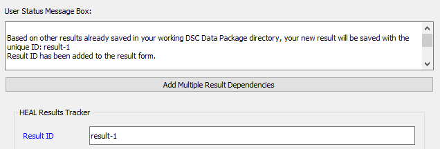
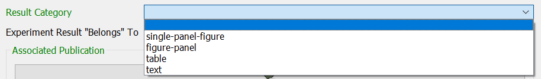
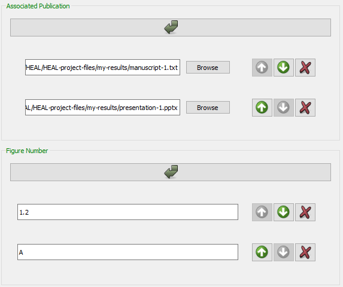
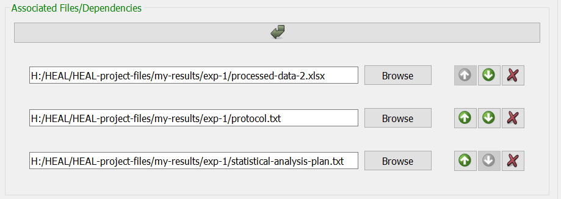

# Adding a New Result

Your first step to creating a new Results Tracker is to start annotating results. **You do not need to create a Results Tracker first.** The tool will auto-generate the appropriate Results Trackers based on annotated results.

### Getting Started Annotating

1. Navigate to the "Add Results" tab and select "Annotate a New Result,"
    
    <figure markdown>
        
        <figcaption></figcaption>
    </figure>

2. Select "Add your DSC Package Directory." Navigate to your dsc-pkg folder and click "Select Folder". This will set your results to be saved to the dsc-pkg folder.
    1. This also detects whether there are existing results saved in the folder and automatically generates the next sequential Result ID (e.g., result-1, result-2, etc.).
    2. If successful, the User Status Message Box will deliver this message (Note: You may need to scroll within the box to locate the message):

    <figure markdown>
        
        <figcaption></figcaption>
    </figure>
    
### Filling Out the Form

!!! Tip
    * For additional information about each form field, please refer to the [Results Tracker schema](../schemas/md_results_tracker.md).
    * Hovering over each field in the form will provide additional information about what should be contained within the field. For example, for the Result Category field:
        

1. The Result ID should be automatically generated.
2. Fill out a short Result Description.

    <figure markdown>
        
        <figcaption></figcaption>
    </figure>

#### Result Category

1. Select a Result Category. Based on the Result Category selected, additional questions will appear within the form.

    <figure markdown>
        
        <figcaption></figcaption>
    </figure>

2. For results in any Result Category, you will need to provide the path for the Associated Multi-Result File (e.g., manuscript, poster, etc.), in which the individual result appears. To add, select the arrow below the field:

    <figure markdown>
        
        <figcaption></figcaption>
    </figure>
        
    If the result is associated with multiple multi-result files, click the box again and enter the paths to each of the multi-result files here. This will allow the app to create a results tracker for each of those multi-result files in future steps (or add the individual result to the righ results trackers), all of which will be associated with this result.

    <figure markdown>
        
        <figcaption></figcaption>
    </figure>
        
3. If you selected "Figure" within "Result Category," the "Figure Number" field will pop up under "Associated Multi-Result File."
    1. For each "Associated Multi-Result File", you will need to provide a corresponding figure number. Click on the arrow to insert each figure number. 
        1. Ensure that the figure numbers are in the same order as the multi-result files. You can adjust the order using the green up and down arrows.
        
        <figure markdown>
            
            <figcaption></figcaption>
        </figure>
        
#### Associated Files/Dependencies

1. There are two ways to add "Associated Files/Dependencies," manually or via batch add. See below for descriptions of each.

    !!! Warning

        **You should only utilize one of the below methods for entering dependencies when adding a specific result.** If you add some files as associated files/dependencies manually and then utilize the "Add Multiple Results Dependencies" option, those files will overwrite the files you entered manually.

    ##### Manually adding Associated Files/Dependencies

    1. If you are adding only a few associated files/dependencies, you can add each row individually using the arrow button:

    

    ##### Batch adding Associated Files/Dependencies

    1. If you would like to add many associated files at once, you can use the "Add Multiple Results Dependencies" option, which can be found at the top of the "Add Results" window:

        

        1. Fill in this field with associated files/dependencies using drag-and-drop from your file explorer.

        

        2. The files you drag and drop will automatically appear in the "Associated Files/Dependencies" section in the form.

        

#### Results Support

1. "Results Supports" describes the larger claim that the result is used to support in the multi-result file. This is not required but can be very useful for data reuse and interpretation for future researchers.

    

### Saving Your Result

1. When you are done filling out the form, select "Save result."
2. The User Status Message Box should display this message to indicate your result saved successfully:

    <figure markdown>
        
        <figcaption></figcaption>
    </figure>

    1. Your result tracker annotation will be saved as a .txt file within the dsc-pkg folder.

    <figure markdown>
        
        <figcaption></figcaption>
    </figure>

3. Clear the form.
4. You can now start annotating the next result by selecting the DSC Package Directory.

            