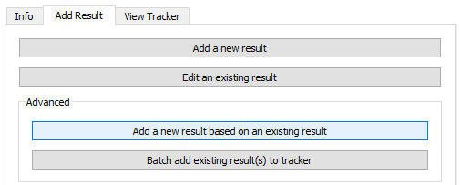
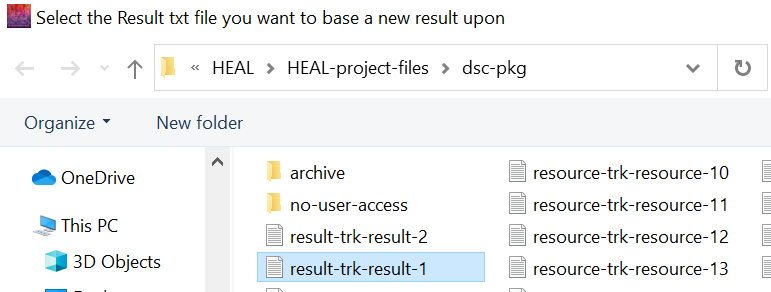
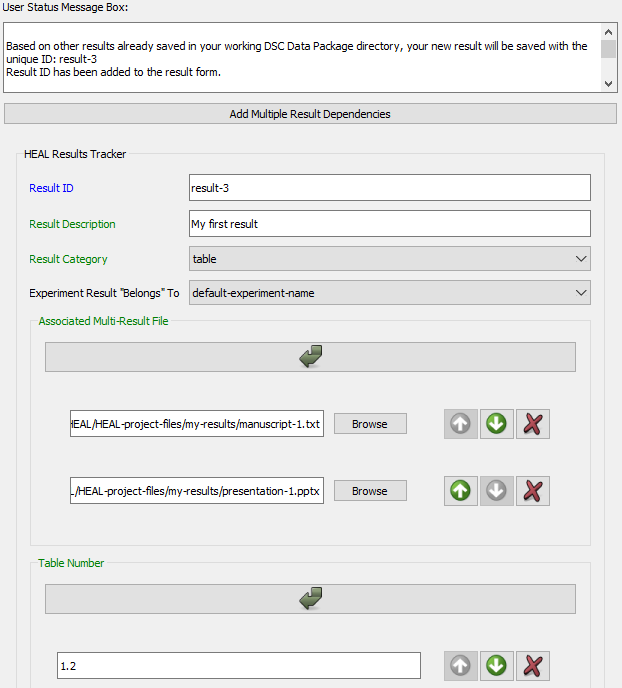
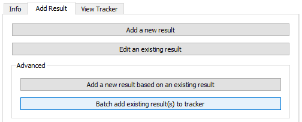
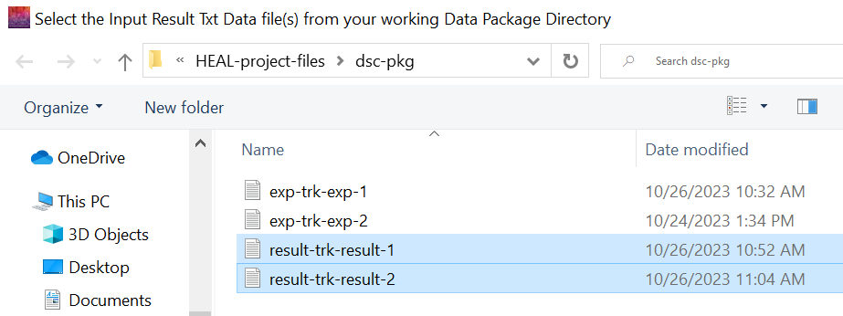
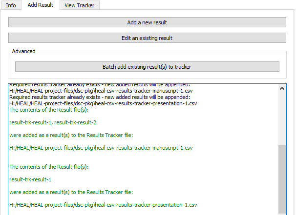

# Advanced

## Add a New Result Based on an Existing Result

If you need to annotate a result that is very similar to a previously annotated result, with only small changes, you may want to use the "Add a new result based on an existing result" option. 

With this feature, you will select a previously annotated result, and the tool will copy the information from the chosen result into a new result annotation form with a unique result-ID. You will then only need to edit the information rather than reproduce it.

1. Select "Add a new result based on an existing result."

    <figure markdown>
        
        <figcaption></figcaption>
    </figure>

2. Your working data package folder will open automatically. Select the result on which you want to base your new result annotation. 

    <figure markdown>
        
        <figcaption></figcaption>
    </figure>

3. The annotate result form will open and populate with the selected result information with a unique ID.

    <figure markdown>
        
        <figcaption></figcaption>
    </figure>

4. Edit the form to reflect the differences in this new result. Save the form.

## Batch Add Result(s) to Tracker

If you try to save a result while you have the corresponding Results Tracker open, you will receive an error. The annotated result file will save as a .txt file within the dsc-pkg folder, but it will not be added to the Results Tracker. You will need to do this manually using the "Batch add existing result(s) to tracker" option.

1. Ensure that none of your Results Trackers are open before attempting to batch add results.
1. Navigate to the "Add Result" tab and select "Batch add existing result(s) to tracker" under "Advanced."

    <figure markdown>
        
        <figcaption></figcaption>
    </figure>

3. Select the results that you want to add.
    1. It may be easiest to select all existing annotated result files when using this feature. The tool will scan the result files you select and only add those that are not already included in within the Results Tracker, so selecting a file that has already been included in the Results Tracker will not produce an error here.
    2. Note: These files follow the naming convention "result-trk-result-"

    <figure markdown>
        
        <figcaption></figcaption>
    </figure>

4. If your files are successfully added to the appropriate Results Trackers, the User Status Message Box will provide a confirmation message:

    <figure markdown>
        
        <figcaption></figcaption>
    </figure>