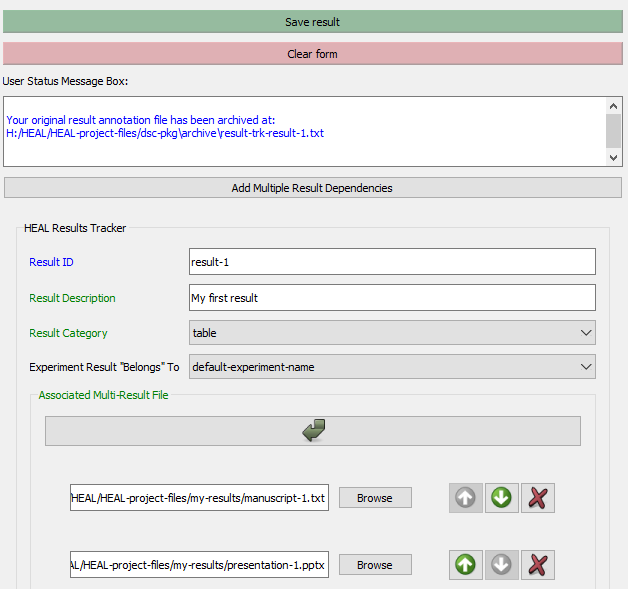

---
hide:
  - toc
full-width: true
---

# Editing a Result

If you want to edit a result after you have created it, you can do so in the tool using the "Edit existing result" feature. 

!!! Info
    We encourage you to use the form to edit your results rather than entering/editing information manually into the Results Tracker CSV, as the tool will automatically put your information into the correct formatting and structure. Manual edits will not necessarily be in the correct format.

1. Select "Edit existing result" in the "Add Result" tab.

    

2. Navigate to your dsc-pkg folder and select the annotated result .txt file that you want to edit.

    *For example:*

    

3. The information on your annotated result will populate in the "Annotate Result" window.

    

    1. When you edit your first result, the tool will create an "archive" folder and will archive the original version of your result annotation (.txt) file there, so there are no issues with file naming. The User Status Message Box will also display a message providing information on the location of the original annotation file.

        

4. Make any necessary edits to your result file, and then select "Save result".