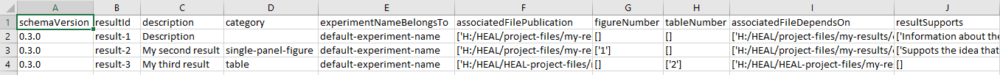

---
hide:
  - toc
full-width: true
---

# About the Results Tracker

{: loading=lazy width="550" align=right } This tab will help you create and fill out the Results Tracker(s). Each Results Tracker provides an annotated inventory of all results included in a publication. The depth and extent of information included in a Results Tracker will be determined by the approach you have chosen for annotation of your data.

You will have one Results Tracker for **each** publication (e.g., manuscript, poster, etc.) that you share. If you only have one publication that you are planning to share, you will only have one Results Tracker. However, if you have multiple publications, you will have a Results Tracker for each publication.

In addition to the publication-specific Results Trackers, you will have one overall Results Tracker, which is a compilation of all individual results you have annotated within the tool, including results that are not yet associated with a publication. This tracker is called heal-csv-results-tracker-collect-all.

   

!!! note "A Note on the Results Tracker"

    Unlike the Experiment Tracker, Resource Tracker, and Results Tracker "collect-all" shells, which automatically appeared in your dsc-pkg directory when it was created, you will create the publication-specific Results Tracker(s) through the process of adding individual results.

*Example of a Results Tracker with multiple individual results annotated:*

