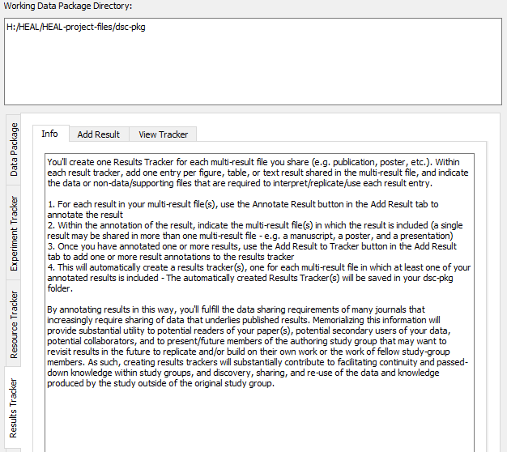

---
hide:
  - toc
full-width: true
---

# About the Results Tracker

{: loading=lazy width="550" align=right } This tab creates the results tracker, which provides an annotated inventory of all results included in a multi-result file. The depth and extent of information included in a result tracker will be determined by the approach you have chosen for annotation of your data. This documentation will include information on how you should fill out each form based on your chosen annotation approach.

You should create one Results Tracker for **each** multi-result file (e.g., manuscript, poster, etc.) that you share. If you only have one multi-result file that you are planning to share, you will only need to create one results tracker. However, if you have multiple multi-result files, you will need to create a results tracker for each multi-result file.

       

*Example of a Results Tracker with multiple individual results annotated:*

!!! note "A Note on the Results Tracker"

    Unlike the experiment tracker and resource tracker shells, which automatically appeared in your dsc-pkg folder, you will create the Results Tracker(s) through the process of adding individual results.

