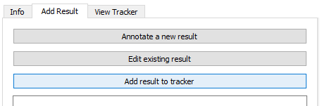
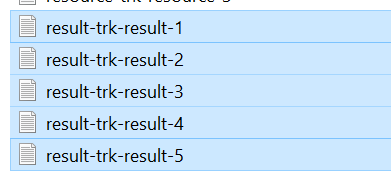
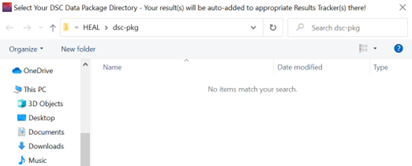
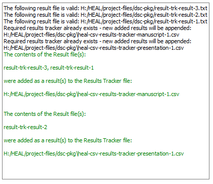

---
hide:
  - toc
full-width: true
---

# Adding Result(s) to Result Tracker(s)

Once you have annotated your results files, close the "Annotate Result" window and return to the "Add Result" tab.

1. Click on "Add result to tracker."

    <figure markdown>
        
        <figcaption></figcaption>
    </figure>
    
2. Navigate to the results that you want to add. You can select multiple by holding down "ctrl" ("command" on a Mac) while selecting your results files.

    <figure markdown>
        
        <figcaption></figcaption>
    </figure>

3. After selecting these files, another window will pop up to select your DSC package directory, which is where your results trackers will generate (this should be the same folder where your results annotation txt files are saved). If you have not already created results trackers, your folder should show no trackers found when you select the dsc-pkg folder:

    <figure markdown>
        
        <figcaption></figcaption>
    </figure>

4. Once you select the folder, you will receive information in the User Status Message Box notifying you that the Results Tracker(s) have been created based on your results file(s). 
    
    *In the example below, results added were associated with two different multi-result files, so two results trackers were created and saved in the dsc-pkg folder. And the individual results were automatically entered into each tracker, as appropriate.*

    <figure markdown>
        
        <figcaption></figcaption>
    </figure>

5. Once the Results Trackers have been generated through this step, you can still continue to add results to your existing Results Trackers using the "Add result to tracker" option. New results will be added to the corresponding Results Tracker files.
6. Once you have entered a few results, you may want to review your Results Tracker(s) to ensure that your results have been entered correctly.

!!! note "Viewing and Editing the Tracker"

    You can review your Results Tracker at any point using the [view feature](viewresult.md). If you find there is something you would like to add to an entry or an error that you would like to correct, you can [edit any result within the tool](editresult.md).
