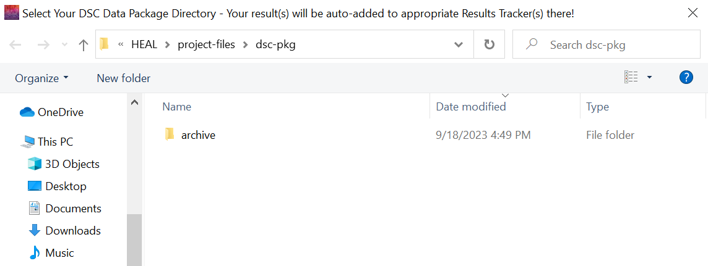

# Adding Result(s) to Result Tracker(s)

Once you have annotated your results files, close the "Annotate Result" window and return to the "Add Result" tab. You have two options:

1. Automatically create Results Trackers and add results using "Auto-add result to tracker". We recommend this method, as it is easier and you can add multiple results at once.
2. Create a new Results Tracker (or Trackers if you have more than one multi-result file) and add each result to the tracker manually.

#### Auto-Add Results To Results Tracker(s)

1. Click on "Auto-add result to tracker".

    

2. Navigate to the results that youw ant to add. You can select multiple by holding down "ctrl" ("command" on a Mac) while selecting your results files.

    

3. After selecting these files, another window will pop up to select your DSC package directory, which is where your results trackers will generate (this should be the same folder where your results annotation txt files are saved). If you have not already created results trackers, your folder should show no trackers found when you select the dsc-pkg folder:

    

4. Once you select the folder, you will receive information in the User Status Message Box notifying you that the Results Tracker(s) have been created based on your results file(s). 
    
    *In the example below, each result was assocaited with two different multi-result files, so two results trackers were created and saved in the dsc-pkg folder. And the individual results were entered into each tracker, as appropriate.*

    

5. Once the Results Trackers have been generated through this step, you can still continue to use the "Auto-add result to tracker" option. New results will be added to the corresponding Results Tracker files.
6. Once you have entered a few results, you may want to review your Results Tracker(s) to ensure that your results have been entered correctly.

#### Manually Create Results Tracker(s)

If you would like to create an empty Results Tracker and add each result manually, follow these instructions:

1. Navigate to the "Create Result Tracker" tab.

    

2. Navigate to and select your dsc-pkg directory in the pop-up window.
3. The "Save As" window will open. Save the Results Tracker in the dsc-pkg directory; replace "(multi-result file to which this results tracker applies)" with the name of your multi-result file:

    

4. If this is successful, the User Status Message Box will display a confirmation:

    

##### Manually saving a result to the Results Tracker

1. Navigate to "Add Results" and select "Add result to tracker".

    

