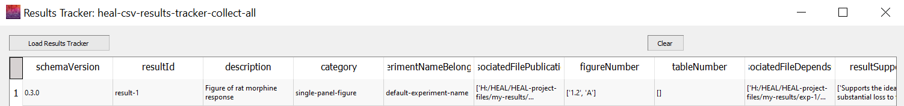

---
hide:
  - toc
full-width: true
---

# Viewing the Results Tracker

If you need to view anything that you have already input into the Results Tracker, you can use the View Tracker feature. It may be useful to view your Results Tracker within the application to:

* Review which individual results associated with a multi-result file that you have already annotated and determining which you still need to annotate.
* Find/confirm the result ID for a particular result to determine where edits need to be made when there has been a change.

***

1. Navigate to "View Tracker" on the Results Tracker tab. Select "View CSV."

    <figure markdown>
        
        <figcaption></figcaption>
    </figure>
    
2. The window below will pop up. Select "Load CSV."

    1. Find and select the results tracker.
    2. Your results tracker will populate in the window.

    <figure markdown>
      
      <figcaption></figcaption>
    </figure>