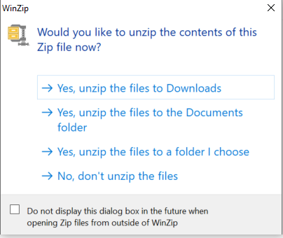
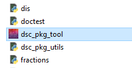

# Downloading the Tool

1. If you have a previous version saved in your File Explorer where you would like to save the new version of the tool, you will want to delete the old version or move it to an archive folder first.
2. Navigate to the download link and download the tool.
3. Unzip the files.
    * You can unzip the files to your downloads folder or to another folder that you prefer, but you must unzip the files in order to be able to run and open the tool successfully.
    
    

4. Once you have unzipped the files, open the newly created dsc-pkg-tool folder.
    * Within this folder, there will be many files and folders, but you want to locate the "dsc_pkg_tool" executable file. Double click the file to open the tool.

    